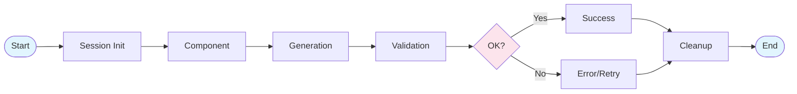
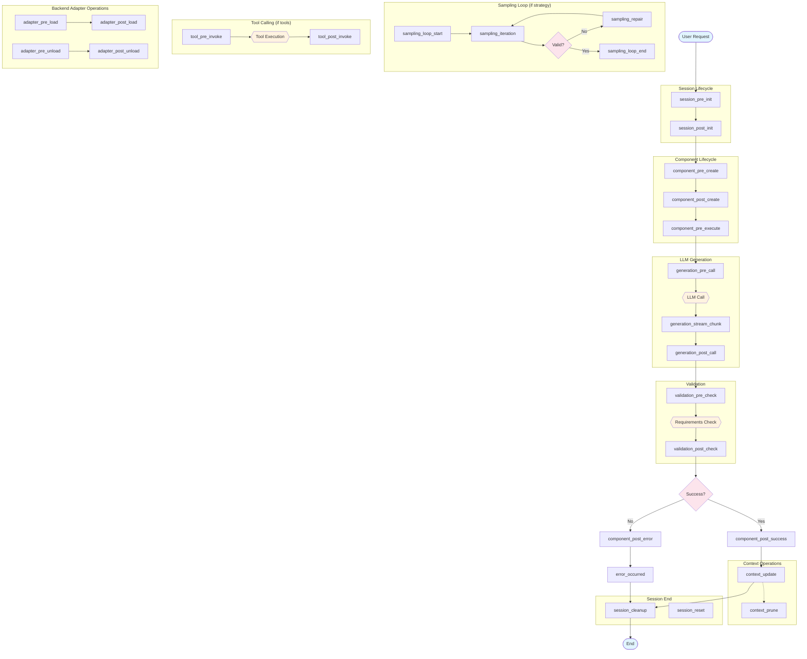

# Mellea Plugin Hook System Design Document

Mellea's hook system provides extension points for deployed generative AI applications that need policy enforcement, observability, and customization without modifying core library code. Hooks enable plugins to register and respond to events throughout the framework's execution lifecycle, from session initialization through generation, validation, and cleanup.

## 1. Overview

### Design Principles

1. **Consistent Interface**: All hooks follow the same async pattern with payload and context parameters
2. **Composable**: Multiple plugins can register for the same hook, executing in priority order
3. **Fail-safe**: Hook failures can be handled gracefully without breaking core execution
4. **Minimal Intrusion**: Plugins are opt-in; default Mellea behavior remains unchanged without plugins. Plugins work identically whether invoked through a session (`m.instruct(...)`) or via the functional API (`instruct(backend, context, ...)`)
5. **Architecturally Aligned**: Hook categories reflect Mellea's true abstraction boundaries — Session lifecycle, Component lifecycle, and the (Backend, Context) generation pipeline
6. **Code-First**: Plugins are defined and composed in Python. The `@hook` decorator and `Plugin` base class are the primary registration mechanisms; YAML configuration is a secondary option for deployment-time overrides
7. **Functions-First**: The simplest plugin is a plain async function decorated with `@hook`. Class-based plugins (via the `Plugin` base class) exist for stateful, multi-hook scenarios but are not required

### Hook Method Signature

All hooks follow this consistent async pattern:

```python
# Standalone function hook (primary)
@hook("hook_name", mode=PluginMode.SEQUENTIAL, priority=50)
async def my_hook(
    payload: PluginPayload,
    context: PluginContext
) -> PluginResult | None

# Class-based method hook
class MyPlugin(Plugin, name="my-plugin"):
    @hook("hook_name")
    async def my_hook(
        self,
        payload: PluginPayload,
        context: PluginContext
    ) -> PluginResult | None
```

- **`payload`**: Immutable (frozen), strongly-typed data specific to the hook point. Plugins use `model_copy(update={...})` to propose modifications
- **`context`**: Read-only shared context with session metadata and utilities
- **`mode`**: `PluginMode.SEQUENTIAL` (default), `PluginMode.CONCURRENT`, `PluginMode.AUDIT`, or `PluginMode.FIRE_AND_FORGET` — controls execution behavior (see Execution Mode below)
- **`priority`**: Lower numbers execute first (default: 50)
- **Returns**: A `PluginResult` with continuation flag, modified payload, and violation/explanation — or `None` to continue unchanged

### Concurrency Model

Hooks use Python's `async`/`await` cooperative multitasking. Because Python's event loop only switches execution at `await` points, hook code won't be interrupted mid-logic. This means:

- **Sequential when awaited**: Calling `await hook(...)` keeps control flow deterministic — the hook completes before the caller continues.
- **Race conditions only at `await` points**: Shared state is safe to read and write between `await` calls within a single hook. Races only arise if multiple hooks modify the same shared state and are dispatched concurrently.
- **No preemptive interruption**: Unlike threads, a hook handler runs uninterrupted until it yields control via `await`.

### Execution Mode

Hooks support five execution modes, configurable per-registration via the `mode` parameter on the `@hook` decorator. Each mode defines a unique combination of two orthogonal capabilities — **blocking** (halting the pipeline) and **modifying** (changing the payload):

| Mode | Can block | Can modify | Execution | Use case |
|------|:---------:|:----------:|-----------|----------|
| **`PluginMode.SEQUENTIAL`** (default) | Yes | Yes | Serial, chained | Policy enforcement + transformation |
| **`PluginMode.TRANSFORM`** | No | Yes | Serial, chained | Data transformation (PII redaction, prompt rewriting) |
| **`PluginMode.AUDIT`** | No | No | Serial | Observation, logging, metrics |
| **`PluginMode.CONCURRENT`** | Yes | No | Parallel | Independent policy gates |
| **`PluginMode.FIRE_AND_FORGET`** | No | No | Background | Telemetry, async side effects |

Execution order: **SEQUENTIAL → TRANSFORM → AUDIT → CONCURRENT → FIRE_AND_FORGET**.

- **SEQUENTIAL** hooks are awaited inline, in priority order. Each receives the chained payload from prior hooks. Can halt the pipeline via `PluginResult(continue_processing=False)` and modify writable fields.
- **TRANSFORM** hooks are awaited inline, in priority order, after all SEQUENTIAL hooks. Each receives the chained payload. Can modify writable fields but **cannot** halt the pipeline — blocking results are suppressed with a warning.
- **AUDIT** hooks are awaited inline, in priority order, after TRANSFORM. Observe-only: payload modifications are **discarded** and violations are logged but do not block. Use for monitoring and gradual policy rollout.
- **CONCURRENT** hooks are dispatched in parallel after AUDIT. Can halt the pipeline (fail-fast on first blocking result) but payload modifications are **discarded** to avoid non-deterministic last-writer-wins races.
- **FIRE_AND_FORGET** hooks are dispatched via `asyncio.create_task()` after all other phases. They receive a copy-on-write snapshot of the payload. Cannot modify payloads or block execution. Any exceptions are logged but do not propagate.

> **Note**: All five modes are exposed via Mellea's own `PluginMode` enum, which maps to CPEX's internal `PluginMode`. The additional `disabled` mode remains available in CPEX's enum and YAML configuration for deployment-time control, but is not exposed in Mellea's `PluginMode`. It is a deployment concern, not a definition-time concern.

### Plugin Framework

The hook system is backed by a lightweight plugin framework built as a Mellea dependency (not a separate user-facing package). This framework:

- Provides the `@hook` decorator for registering standalone async functions as hook handlers
- Provides the `Plugin` base class for multi-hook plugins with automatic context-manager support and metadata via `__init_subclass__` keyword arguments
- Exposes `PluginSet` for grouping related hooks/plugins into composable, reusable units
- Exposes `register()` for global plugin registration and `block()` as a convenience for returning blocking `PluginResult`s
- Implements a plugin manager that loads, registers, and governs the execution of plugins
- Enforces per-hook-type payload policies via `HookPayloadPolicy`, accepting only writable-field changes from plugins

The public API surface:

```python
from mellea.plugins import Plugin, hook, block, PluginSet, register
```

### Global vs Session-Scoped Plugins

Plugins can be registered at two scopes:

- **Global**: Registered via `register()` at module or application startup. Global plugins fire for every hook invocation — both session-based (`m.instruct(...)`) and functional (`instruct(backend, context, ...)`).
- **Session-scoped**: Passed via the `plugins` parameter to `start_session()`. Session-scoped plugins fire only for hook invocations within that session.

Both scopes coexist. When a hook fires within a session, both global plugins and that session's plugins execute, ordered by priority. When a hook fires via the functional API outside a session, only global plugins execute.

**Implementation**: A single `PluginManager` instance manages all plugins. Plugins are tagged with an optional `session_id`. At dispatch time, the manager filters: global plugins (no session tag) always run; session-tagged plugins run only when the dispatch context matches their session ID.

**Functional API support**: The functional API (`instruct(backend, context, ...)`) does not require a session. Hooks still fire at the same execution points. If global plugins are registered, they execute. If no plugins are registered, hooks are no-ops with zero overhead.

### With-Block-Scoped Context Managers

In addition to global and session-scoped registration, plugins can be activated for a specific block of code using the context manager protocol. Plugins are registered on entry and deregistered on exit, even if the block raises an exception.

This is useful for:
- Feature flags: enable a plugin only during a specific operation
- Testing: activate a mock or spy plugin around a single call
- Middleware injection: wrap a third-party call with additional hooks without polluting global state
- Composing scopes: stack independent scopes that each clean up after themselves

Three equivalent forms are supported:

**1. `plugin_scope(*items)` factory**

Accepts standalone `@hook` functions, `Plugin` subclass instances, `PluginSet`s, or any mix:

```python
from mellea.plugins import plugin_scope

with plugin_scope(log_request, log_response):
    result = m.instruct("Name the planets.")
# log_request and log_response are deregistered here

with plugin_scope(pii_redactor, observability_set, enforce_budget):
    result = m.instruct("Summarize the customer record.")
```

**2. `Plugin` subclass instance as context manager**

Any instance of a `Plugin` subclass can be entered directly as a context manager:

```python
guard = ContentGuard()  # ContentGuard inherits from Plugin
with guard:
    result = m.instruct("What is the boiling point of water?")
# ContentGuard hooks are deregistered here
```

**3. `PluginSet` as context manager**

A `PluginSet` can be entered directly, activating all of its contained hooks and plugins:

```python
with observability:  # observability is a PluginSet
    result = m.instruct("What is the capital of France?")
# All observability hooks are deregistered here
```

**Async variants**

All three forms also support `async with` for use in async code:

```python
async with plugin_scope(log_request, ContentGuard()):
    result = await m.ainstruct("Describe the solar system.")

async with observability:
    result = await m.ainstruct("What is the capital of France?")
```

**Nesting and mixing**

Scopes stack cleanly, i.e., each exit deregisters only its own plugins. Nesting is independent of form:

```python
with plugin_scope(log_request):          # outer scope
    with ContentGuard() as guard:        # inner scope: Plugin subclass instance
        result = m.instruct("...")       # log_request + ContentGuard active
    result = m.instruct("...")           # only log_request active
# no plugins active
```

**Cleanup guarantee**

Plugins are always deregistered on scope exit, even if the block raises an exception. There is no resource leak on error.

**Re-entrant restriction**

The same instance cannot be active in two overlapping scopes simultaneously. Attempting to re-enter an already-active instance raises `RuntimeError`. To run the same plugin logic in parallel or in nested scopes, create separate instances:

```python
guard1 = ContentGuard()
guard2 = ContentGuard()  # separate instance

with guard1:
    with guard2:  # OK — different instances
        ...

with guard1:
    with guard1:  # RuntimeError — same instance already active
        ...
```

**Implementation note**: With-block scopes use the same `session_id` tagging mechanism as session-scoped plugins. Each `with` block gets a unique UUID scope ID; the plugin manager filters plugins by scope ID at dispatch time and deregisters them by scope ID on exit. This means with-block plugins coexist with global and session-scoped plugins: all three layers execute together, ordered by priority.

### Hook Invocation Responsibilities

Hooks are called from Mellea's base classes (`Component.aact()`, `Backend.generate()`, `SamplingStrategy.run()`, etc.). This means hook invocation is a framework-level concern, and authors of new backends, sampling strategies, or components do not need to manually insert hook calls.

The calling convention is a single async call at each hook site:

```python
result = await invoke_hook(hook_type, payload, backend=backend)
```

The caller (the base class method) is responsible for both invoking the hook and processing the result. Processing means checking the result for one of three possible outcomes:

1. **Continue with original payload**: — `PluginResult(continue_processing=True)` with no `modified_payload`. The caller proceeds unchanged.
2. **Continue with modified payload**: — `PluginResult(continue_processing=True, modified_payload=...)`. The plugin manager applies the hook's payload policy, accepting only changes to writable fields and discarding unauthorized modifications. The caller uses the policy-filtered payload in place of the original.
3. **Block execution** — `PluginResult(continue_processing=False, violation=...)`. The caller raises or returns early with structured error information.

Hooks cannot redirect control flow, jump to arbitrary code, or alter the calling method's logic beyond these outcomes. This is enforced by the `PluginResult` type.

### Payload Design Principles

Hook payloads follow six design principles:

1. **Strongly typed** — Each hook has a dedicated payload dataclass (not a generic dict). This enables IDE autocompletion, static analysis, and clear documentation of what each hook receives.
2. **Sufficient (maximize-at-boundary)** — Each payload includes everything available at that point in time. Post-hooks include the pre-hook fields plus results. This avoids forcing plugins to maintain their own state across pre/post pairs.
3. **Frozen (immutable)** — Payloads are frozen Pydantic models (`model_config = ConfigDict(frozen=True)`). Plugins cannot mutate payload attributes in place. To propose changes, plugins must call `payload.model_copy(update={...})` and return the copy via `PluginResult.modified_payload`. This ensures every modification is explicit and flows through the policy system.
4. **Policy-controlled** — Each hook type declares a `HookPayloadPolicy` specifying which fields are writable. The plugin manager applies the policy after each plugin returns, accepting only changes to writable fields and silently discarding unauthorized modifications. This separates "what the plugin can observe" from "what the plugin can change" — and enforces it at the framework level. See [Hook Payload Policies](#hook-payload-policies) for the full policy table.
5. **Serializable** — Payloads should be serializable for external (MCP-based) plugins that run out-of-process. All payload fields use types that can round-trip through JSON or similar formats.
6. **Versioned** — Payload schemas carry a `payload_version` so plugins can detect incompatible changes at registration time rather than at runtime.
7. **Isolation** — Each plugin receives a copy-on-write (CoW) snapshot of the payload. Mutable containers (dicts, lists) are wrapped so mutations in one plugin do not affect others. Plugins should not cache payloads beyond the hook invocation — payload fields reference live framework objects (`Context`, `Component`, `MelleaSession`) whose lifecycle is managed by the framework.

## 2. Common Payload Fields

All hook payloads inherit these base fields:

```python
class BasePayload(PluginPayload):
    """Frozen base — all payloads are immutable by design."""
    model_config = ConfigDict(frozen=True, arbitrary_types_allowed=True)

    session_id: str | None = None      # Session identifier (None for functional API calls)
    request_id: str = ""               # Reserved for future use (e.g., request tracing)
    timestamp: datetime                # When the event fired
    hook: str                          # Name of the hook (e.g., "generation_pre_call")
    user_metadata: dict[str, Any]      # Custom metadata carried by user code
```

> **Note on `session_id` and `request_id`**: These fields exist on the base payload schema but are **not** automatically stamped by the framework at dispatch time. `session_id` is available when the caller sets it on the payload directly. `request_id` is reserved for future request-tracing support.

## 3. Hook Summary Table

| Priority | Hook Point | Category | Domain | Status | Description |
|:--:|------------|----------|--------|:--------:|-------------|
|3| `session_pre_init` | Session Lifecycle | Session | ✔️ | Before session initialization |
|3| `session_post_init` | Session Lifecycle | Session | ✔️ | After session is fully initialized |
|3| `session_reset` | Session Lifecycle | Session | ✔️ | When session context is reset |
|3| `session_cleanup` | Session Lifecycle | Session | ✔️ | Before session cleanup/teardown |
|7| `component_pre_create` | Component Lifecycle | Component / (Backend, Context) |  | Before component creation |
|7| `component_post_create` | Component Lifecycle | Component / (Backend, Context) |  | After component created, before execution |
|7| `component_pre_execute` | Component Lifecycle | Component / (Backend, Context) | ✔️ | Before component execution via `aact()` |
|7| `component_post_success` | Component Lifecycle | Component / (Backend, Context) | ✔️ | After successful component execution |
|7| `component_post_error` | Component Lifecycle | Component / (Backend, Context) | ✔️ | After component execution fails |
|1| `generation_pre_call` | Generation Pipeline | (Backend, Context) | ✔️ | Before LLM backend call |
|1| `generation_post_call` | Generation Pipeline | (Backend, Context) | ✔️ | After LLM response received |
|1| `generation_stream_chunk` | Generation Pipeline | (Backend, Context) |  | For each streaming chunk |
|1| `validation_pre_check` | Validation | (Backend, Context) | ✔️ | Before requirement validation |
|1| `validation_post_check` | Validation | (Backend, Context) | ✔️ | After validation completes |
|3| `sampling_loop_start` | Sampling Pipeline | (Backend, Context) | ✔️ | When sampling strategy begins |
|3| `sampling_iteration` | Sampling Pipeline | (Backend, Context) | ✔️ | After each sampling attempt |
|3| `sampling_repair` | Sampling Pipeline | (Backend, Context) | ✔️ | When repair is invoked |
|3| `sampling_loop_end` | Sampling Pipeline | (Backend, Context) | ✔️ | When sampling completes |
|1| `tool_pre_invoke` | Tool Execution | (Backend, Context) | ✔️ | Before tool/function invocation |
|1| `tool_post_invoke` | Tool Execution | (Backend, Context) | ✔️ | After tool execution |
|5| `adapter_pre_load` | Backend Adapter Ops | Backend |  | Before `backend.load_adapter()` |
|5| `adapter_post_load` | Backend Adapter Ops | Backend |  | After adapter loaded |
|5| `adapter_pre_unload` | Backend Adapter Ops | Backend |  | Before `backend.unload_adapter()` |
|5| `adapter_post_unload` | Backend Adapter Ops | Backend |  | After adapter unloaded |
|7| `context_update` | Context Operations | Context |  | When context changes |
|7| `context_prune` | Context Operations | Context |  | When context is trimmed |
|7| `error_occurred` | Error Handling | Cross-cutting |  | When an unrecoverable error occurs |

## 3b. Hook Payload Policies

Payload mutability is enforced at **two layers**:

1. **Execution mode** (cpex layer) — only `SEQUENTIAL` and `TRANSFORM` plugins can modify payloads. `AUDIT`, `CONCURRENT`, and `FIRE_AND_FORGET` plugins have their modifications silently discarded by cpex regardless of what the policy table says.

2. **Field-level policy** (Mellea layer) — for modes that *can* modify, each hook type declares a `HookPayloadPolicy` specifying which fields are writable. The plugin manager applies the policy after each plugin returns: only changes to writable fields are accepted; all other modifications are silently discarded.

Hooks not listed in the policy table are **observe-only** — with `DefaultHookPolicy.DENY` (the Mellea default), any modification attempt on an unlisted hook is rejected at runtime.

### Policy Types

```python
from dataclasses import dataclass
from enum import Enum

class DefaultHookPolicy(str, Enum):
    """Controls behavior for hooks without an explicit policy."""
    ALLOW = "allow"   # Accept all modifications (backwards-compatible)
    DENY = "deny"     # Reject all modifications (strict mode, default for Mellea)

@dataclass(frozen=True)
class HookPayloadPolicy:
    """Defines which payload fields plugins may modify."""
    writable_fields: frozenset[str]
```

### Policy Enforcement

When a plugin returns `PluginResult(modified_payload=...)`, the plugin manager applies `apply_policy()`:

```python
def apply_policy(
    original: BaseModel,
    modified: BaseModel,
    policy: HookPayloadPolicy,
) -> BaseModel | None:
    """Accept only changes to writable fields; discard all others.

    Returns an updated payload via model_copy(update=...), or None
    if the plugin made no effective (allowed) changes.
    """
    updates: dict[str, Any] = {}
    for field in policy.writable_fields:
        old_val = getattr(original, field, _SENTINEL)
        new_val = getattr(modified, field, _SENTINEL)
        if new_val is not _SENTINEL and new_val != old_val:
            updates[field] = new_val
    return original.model_copy(update=updates) if updates else None
```

### Policy Table

| Hook Point | Writable Fields |
|------------|----------------|
| **Session Lifecycle** | |
| `session_pre_init` | `model_id`, `model_options` |
| `session_post_init` | *(observe-only)* |
| `session_reset` | *(observe-only)* |
| `session_cleanup` | *(observe-only)* |
| **Component Lifecycle** | |
| `component_pre_create` | `description`, `images`, `requirements`, `icl_examples`, `grounding_context`, `user_variables`, `prefix`, `template_id` |
| `component_post_create` | `component` |
| `component_pre_execute` | `requirements`, `model_options`, `format`, `strategy`, `tool_calls_enabled` |
| `component_post_success` | *(observe-only)* |
| `component_post_error` | *(observe-only)* |
| **Generation Pipeline** | |
| `generation_pre_call` | `model_options`, `format`, `tool_calls` |
| `generation_post_call` | *(observe-only)* |
| `generation_stream_chunk` | `chunk`, `accumulated` |
| **Validation** | |
| `validation_pre_check` | `requirements`, `model_options` |
| `validation_post_check` | `results`, `all_validations_passed` |
| **Sampling Pipeline** | |
| `sampling_loop_start` | `loop_budget` |
| `sampling_iteration` | *(observe-only)* |
| `sampling_repair` | *(observe-only)* |
| `sampling_loop_end` | *(observe-only)* |
| **Tool Execution** | |
| `tool_pre_invoke` | `model_tool_call` |
| `tool_post_invoke` | `tool_output` |
| **Backend Adapter Ops** | |
| `adapter_pre_load` | *(observe-only)* |
| `adapter_post_load` | *(observe-only)* |
| `adapter_pre_unload` | *(observe-only)* |
| `adapter_post_unload` | *(observe-only)* |
| **Context Operations** | |
| `context_update` | *(observe-only)* |
| `context_prune` | *(observe-only)* |
| **Error Handling**| |
| `error_occurred` | *(observe-only)* |

### Default Policy

Mellea uses `DefaultHookPolicy.DENY` as the default for hooks without an explicit policy. This means:

- **Hooks with an explicit policy**: Only writable fields are accepted; other changes are discarded.
- **Hooks without a policy** (observe-only): All modifications are rejected with a warning log.
- **Custom hooks**: Custom hooks registered by users default to `DENY`. To allow modifications, pass a `HookPayloadPolicy` when registering the custom hook type.

### Modification Pattern

Because payloads are frozen, plugins must use `model_copy(update={...})` to create a modified copy:

```python
@hook("generation_pre_call", mode=PluginMode.SEQUENTIAL, priority=10)
async def enforce_budget(payload, ctx):
    if (_estimate_tokens(payload) or 0) > 4000:
        return block("Token budget exceeded")

    # Modify a writable field — use model_copy, not direct assignment
    modified = payload.model_copy(update={"model_options": {**payload.model_options, "max_tokens": 4000}})
    return PluginResult(continue_processing=True, modified_payload=modified)
```

Attempting to set attributes directly (e.g., `payload.model_options = {...}`) raises a `FrozenModelError`.

### Chaining

When multiple plugins modify the same hook's payload, modifications are chained:

1. Plugin A receives the original payload, returns a modified copy.
2. The policy filters Plugin A's changes to writable fields only.
3. Plugin B receives the policy-filtered result from Plugin A.
4. The policy filters Plugin B's changes.
5. The final policy-filtered payload is returned to the caller.

This ensures each plugin sees the cumulative effect of prior plugins, and all modifications pass through the policy filter.

## 4. Hook Definitions

### A. Session Lifecycle Hooks

Hooks that manage session boundaries, useful for initialization, state setup, and resource cleanup.

#### `session_pre_init`

- **Trigger**: Called immediately when `mellea.start_session()` is invoked, before backend initialization.
- **Use Cases**:
  - Loading user-specific policies
  - Validating backend/model combinations
  - Enforcing model usage policies
- **Payload**:
  ```python
  class SessionPreInitPayload(BasePayload):
      backend_name: str              # Requested backend identifier
      model_id: str | ModelIdentifier  # Target model
      model_options: dict | None     # Generation parameters
      context_type: type[Context]    # Context class to use
  ```
- **Context**:
  - `environment`: dict - Environment variables snapshot
  - `cwd`: str - Current working directory


#### `session_post_init`

- **Trigger**: Called after session is fully initialized, before any operations.
- **Use Cases**:
  - Initializing plugin-specific session state
  - Setting up telemetry/observability
  - Registering session-scoped resources
  - Remote logging setup
- **Payload**:
  ```python
  class SessionPostInitPayload(BasePayload):
      session: MelleaSession         # Fully initialized session (observe-only)
  ```
- **Context**:
  - `backend_name`: str - Backend identifier


#### `session_reset`

- **Trigger**: Called when `session.reset()` is invoked to clear context.
- **Use Cases**:
  - Resetting plugin state
  - Logging context transitions
  - Preserving audit trails before reset
- **Payload**:
  ```python
  class SessionResetPayload(BasePayload):
      previous_context: Context      # Context about to be discarded (observe-only)
  ```
- **Context**:
  - `backend_name`: str - Backend identifier


#### `session_cleanup`

- **Trigger**: Called when `session.close()`, `cleanup()`, or context manager exit occurs.
- **Use Cases**:
  - Flushing telemetry buffers
  - Persisting audit trails
  - Aggregating session metrics
  - Cleaning up temporary resources
- **Payload**:
  ```python
  class SessionCleanupPayload(BasePayload):
      context: Context               # Context at cleanup time (observe-only)
      interaction_count: int         # Number of items in context at cleanup
  ```
- **Context**:
  - `backend_name`: str - Backend identifier


### B. Component Lifecycle Hooks

Hooks around Component creation and execution. All Mellea primitives — Instruction, Message, Query, Transform, GenerativeSlot — are Components. These hooks cover the full Component lifecycle; there are no separate hooks per component type.

All component payloads include a `component_type: str` field (e.g., `"Instruction"`, `"Message"`, `"GenerativeSlot"`, `"Query"`, `"Transform"`) so plugins can filter by type. For example, a plugin targeting only generative slots would check `component_type == "GenerativeSlot"`.

Not all `ComponentPreCreatePayload` fields are populated for every component type. The table below shows which fields are available per type (`✓` = populated, `—` = `None` or empty):

| Field | Instruction | Message | Query | Transform | GenerativeSlot |
|-------|:-----------:|:-------:|:-----:|:---------:|:--------------:|
| `description` | ✓ | ✓ | ✓ | ✓ | ✓ |
| `images` | ✓ | ✓ | — | — | ✓ |
| `requirements` | ✓ | — | — | — | ✓ |
| `icl_examples` | ✓ | — | — | — | ✓ |
| `grounding_context` | ✓ | — | — | — | ✓ |
| `user_variables` | ✓ | — | — | — | ✓ |
| `prefix` | ✓ | — | — | — | ✓ |
| `template_id` | ✓ | — | — | — | ✓ |

Plugins should check for `None`/empty values rather than assuming all fields are present for all component types.


#### `component_pre_create`

> **Implementation deferred.** `component_pre_create` and `component_post_create` are not implemented in this iteration of the hook system. See the discussion note below.

- **Trigger**: Called inside `Component.__init__` (specifically `Instruction.__init__` and `Message.__init__`), before attributes are assigned. Fires for every component created, regardless of the code path — whether via `instruct()`/`chat()`, `ainstruct()`/`achat()`, or direct construction (e.g. `Instruction(...)`).
- **Use Cases**:
  - PII redaction on user input
  - Prompt injection detection
  - Input validation and sanitization
  - Injecting mandatory requirements
  - Enforcing content policies
- **Payload**:
  ```python
  class ComponentPreCreatePayload(BasePayload):
      component_type: str                        # "Instruction", "GenerativeSlot", etc.
      description: str                           # Main instruction text
      images: list[ImageBlock] | None            # Attached images
      requirements: list[Requirement | str]      # Validation requirements
      icl_examples: list[str | CBlock]           # In-context learning examples
      grounding_context: dict[str, str]          # Grounding variables
      user_variables: dict[str, str] | None      # Template variables
      prefix: str | CBlock | None                # Output prefix
      template_id: str | None                    # Identifier of prompt template
  ```
- **Context**: `backend` and `context` are not available at this hook point (`None`). The hook fires from `__init__`, where no backend or execution context exists yet.


#### `component_post_create`

> **Implementation deferred.** See the discussion note below.

- **Trigger**: Called at the end of `Component.__init__` (specifically `Instruction.__init__` and `Message.__init__`), after all attributes are set. Fires for every component created, regardless of the code path. Note: because this hook fires inside `__init__`, the component **cannot be replaced** — plugins may only mutate the component's attributes in-place.
- **Use Cases**:
  - Appending system prompts
  - Context stuffing (RAG injection)
  - Logging component patterns
  - Validating final component structure
- **Payload**:
  ```python
  class ComponentPostCreatePayload(BasePayload):
      component_type: str            # "Instruction", "GenerativeSlot", etc.
      component: Component           # The created component
  ```
- **Context**: `backend` and `context` are not available at this hook point (`None`). See `component_pre_create` note above.

> **Discussion — why these hooks are deferred:**
>
> `Component` is currently a `Protocol`, not an abstract base class. This means Mellea has no ownership over component initialization: there are no guarantees about when or how subclass `__init__` methods run, and there is no single interception point that covers all `Component` implementations.
>
> Placing hook calls inside `Instruction.__init__` and `Message.__init__` works for those specific classes, but it is fragile (any user-defined `Component` subclass is invisible to the hooks) and architecturally wrong (the hook system should not need to be threaded manually into every `__init__`).
>
> If `Component` were refactored to an abstract base class, Mellea could wrap `__init__` at the ABC level and fire `component_pre_create` / `component_post_create` generically for all subclasses, without per-class boilerplate.
>
> Until that refactoring is decided and implemented, these two hook types are intentionally excluded from the active hook system. Use `component_pre_execute` for pre-execution policy enforcement, as it fires just before generation and covers the same high-value interception scenarios.


#### `component_pre_execute`

- **Trigger**: Before any component is executed via `aact()`.
- **Use Cases**:
  - Policy enforcement on generation requests
  - Injecting/modifying model options
  - Routing to different strategies
  - Authorization checks
  - Logging execution patterns
- **Payload**:
  ```python
  class ComponentPreExecutePayload(BasePayload):
      component_type: str            # "Instruction", "GenerativeSlot", etc.
      action: Component | CBlock     # The component to execute
      context_view: list[Component | CBlock] | None  # Linearized context
      requirements: list[Requirement]  # Attached requirements (writable)
      model_options: dict            # Generation parameters (writable)
      format: type | None            # Structured output format (writable)
      strategy: SamplingStrategy | None  # Sampling strategy (writable)
      tool_calls_enabled: bool       # Whether tools are available (writable)
  ```
- **Context**:
  - `backend`: Backend
  - `context`: Context


#### `component_post_success`

- **Trigger**: After component execution completes successfully.
- **Use Cases**:
  - Logging generation results
  - Output validation (hallucination check)
  - PII scrubbing from response
  - Applying output transformations
  - Audit logging
  - Collecting metrics
- **Payload**:
  ```python
  class ComponentPostSuccessPayload(BasePayload):
      component_type: str            # "Instruction", "GenerativeSlot", etc.
      action: Component | CBlock     # Executed component      result: ModelOutputThunk       # Generation result (strong reference)
      context_before: Context        # Context before execution      context_after: Context         # Context after execution      generate_log: GenerateLog      # Detailed execution log (strong reference)
      sampling_results: list[SamplingResult] | None  # If sampling was used (strong reference)
      latency_ms: int                # Execution time
  ```
- **Context**:
  - `backend`: Backend
  - `context`: Context
  - `token_usage`: dict | None
  - `original_input`: dict - Input that triggered generation

> **Design Decision: Separate Success/Error Hooks**
>
> `component_post_success` and `component_post_error` are separate hooks rather than a single `component_post` with a sum type over success/failure. The reasons are:
>
> 1. **Registration granularity** — Plugins subscribe to only what they need. An audit logger may only care about errors; a metrics collector may only care about successes.
> 2. **Distinct payload shapes** — Success payloads carry `result`, `generate_log`, and `sampling_results`; error payloads carry `exception`, `error_type`, and `stack_trace`. A sum type would force nullable fields or tagged unions, adding complexity for every consumer.
> 3. **Different execution modes** — Error hooks may be fire-and-forget (for alerting); success hooks may be blocking (for output transformation). Separate hooks allow per-hook execution timing configuration.


#### `component_post_error`

- **Trigger**: When component execution fails with an exception.
- **Use Cases**:
  - Error logging and alerting
  - Custom error recovery
  - Retry logic
  - Graceful degradation
- **Payload**:
  ```python
  class ComponentPostErrorPayload(BasePayload):
      component_type: str            # "Instruction", "GenerativeSlot", etc.
      action: Component | CBlock     # Component that failed      error: Exception               # The exception raised (strong reference)
      error_type: str                # Exception class name
      stack_trace: str               # Full stack trace
      context: Context               # Context at time of error      model_options: dict            # Options used
  ```
- **Context**:
  - `backend`: Backend
  - `context`: Context
  - `recoverable`: bool - Can execution continue


### C. Generation Pipeline Hooks

Low-level hooks between the component abstraction and raw LLM API calls. These operate on the (Backend, Context) tuple — they do not require a session.

> **Context Modification Sequencing**
>
> `action`, `context`, and `context_view` are observe-only on `component_pre_execute` — plugins cannot modify them. `component_pre_execute` is the interception point for adjusting `requirements`, `model_options`, `format`, `strategy`, and `tool_calls_enabled` before generation begins.


#### `generation_pre_call`

- **Trigger**: Just before the backend transmits data to the LLM API.
- **Use Cases**:
  - Tool selection filtering and requirements
  - Prompt injection detection
  - Content filtering
  - Token budget enforcement
  - Cost estimation
  - Prompt caching/deduplication
  - Rate limiting
  - Last-mile formatting
- **Payload**:
  ```python
  class GenerationPreCallPayload(BasePayload):
      action: Component | CBlock           # Source action      context: Context                     # Current context      model_options: dict[str, Any]        # Generation parameters (writable)
      format: type | None                  # Structured output format (writable)
      tool_calls: bool                     # Whether tool calling is enabled (writable)
  ```
- **Context**:
  - `backend`: Backend
  - `context`: Context
  - `backend_name`: str
  - `model_id`: str
  - `provider`: str - Provider name (e.g., "ibm/granite")

- **Notes**:
  - Field `formatted_prompt: str | list[dict] # Final prompt to send` not implemented

#### `generation_post_call`

- **Trigger**: For lazy `ModelOutputThunk` objects (the normal path), fires inside `ModelOutputThunk.astream` after `post_process` completes — at the point where `model_output.value` is fully materialized. For already-computed thunks (e.g. cached responses), fires inline before `generate_from_context` returns. `latency_ms` is measured from the `generate_from_context` call to value availability in both cases.
- **Use Cases**:
  - Output filtering/sanitization
  - PII detection and redaction
  - Response caching
  - Quality metrics collection
  - Hallucination detection
  - Raw trace logging
  - Error interception (API limits/retries)
- **Payload**:
  ```python
  class GenerationPostCallPayload(BasePayload):
      prompt: str | list[dict]       # Sent prompt (from linearization)
      model_output: ModelOutputThunk # Fully computed output thunk
      latency_ms: float              # Elapsed ms from generate_from_context call to value availability
  ```
- **Context**:
  - `backend`: Backend
  - `context`: Context
  - `backend_name`: str
  - `model_id`: str
  - `status_code`: int | None - HTTP status from provider
  - `stream_chunks`: int | None - Number of chunks if streaming
- **Notes**:
  - On the lazy path (normal), `model_output.value` is guaranteed to be available when this hook fires.
  - Replacing `model_output` is supported on both paths. On the lazy path, the original MOT's output fields are updated in-place via `_copy_from`.
  - On the already-computed path (e.g. cached responses), the returned MOT object itself is replaced.

#### `generation_stream_chunk`

- **Trigger**: For each streaming chunk received from the LLM.
- **Use Cases**:
  - Real-time content filtering
  - Progressive output display
  - Early termination on policy violation
  - Streaming analytics
- **Payload**:
  ```python
  class GenerationStreamChunkPayload(BasePayload):
      chunk: str                     # Current chunk text
      accumulated: str               # All text so far
      chunk_index: int               # Chunk sequence number
      is_final: bool                 # Is this the last chunk
  ```
- **Context**:
  - `thunk_id`: str
  - `backend`: Backend
  - `context`: Context
  - `backend_name`: str
  - `model_id`: str


### D. Validation Hooks

Hooks around requirement verification and output validation. These operate on the (Backend, Context) tuple.


#### `validation_pre_check`

- **Trigger**: Before running validation/requirements check.
- **Use Cases**:
  - Injecting additional requirements
  - Filtering requirements based on context
  - Overriding validation strategy
  - Custom validation logic
- **Payload**:
  ```python
  class ValidationPreCheckPayload(BasePayload):
      requirements: list[Requirement]  # Requirements to check (writable)
      target: CBlock | None            # Target to validate      context: Context                 # Current context      model_options: dict              # Options for LLM-as-judge (writable)
  ```
- **Context**:
  - `backend`: Backend
  - `context`: Context
  - `validation_type`: str - "python" | "llm_as_judge"


#### `validation_post_check`

- **Trigger**: After all validations complete.
- **Use Cases**:
  - Logging validation outcomes
  - Triggering alerts on failures
  - Collecting requirement effectiveness metrics
  - Overriding validation results
  - Monitoring sampling attempts
- **Payload**:
  ```python
  class ValidationPostCheckPayload(BasePayload):
      requirements: list[Requirement]
      results: list[ValidationResult]
      all_validations_passed: bool
      passed_count: int
      failed_count: int
      generate_logs: list[GenerateLog | None]  # Logs from LLM-as-judge
  ```
- **Context**:
  - `backend`: Backend
  - `context`: Context
  - `validation_duration_ms`: int


### E. Sampling & Repair Hooks

Hooks around sampling strategies and failure recovery. These operate on the (Backend, Context) tuple — sampling strategies take explicit `(action, context, backend)` arguments and do not require a session.


#### `sampling_loop_start`

- **Trigger**: When a sampling strategy begins execution.
- **Use Cases**:
  - Logging sampling attempts
  - Adjusting loop budget dynamically
  - Initializing sampling-specific state
- **Payload**:
  ```python
  class SamplingLoopStartPayload(BasePayload):
      strategy_name: str             # Strategy class name
      action: Component              # Initial action      context: Context               # Initial context      requirements: list[Requirement]  # All requirements
      loop_budget: int               # Maximum iterations (writable)
  ```
- **Context**:
  - `backend`: Backend
  - `context`: Context
  - `strategy_name`: str
  - `strategy_config`: dict


#### `sampling_iteration`

- **Trigger**: After each sampling attempt, including validation results.
- **Use Cases**:
  - Iteration-level metrics
  - Early termination decisions
  - Debug sampling behavior
  - Adaptive strategy adjustment
- **Payload**:
  ```python
  class SamplingIterationPayload(BasePayload):
      iteration: int                 # 1-based iteration number
      action: Component              # Action used this iteration      result: ModelOutputThunk       # Generation result (strong reference)
      validation_results: list[tuple[Requirement, ValidationResult]]
      all_validations_passed: bool   # Did all requirements pass
      valid_count: int
      total_count: int
  ```
- **Context**:
  - `backend`: Backend
  - `context`: Context
  - `strategy_name`: str
  - `remaining_budget`: int
  - `elapsed_ms`: int


#### `sampling_repair`

- **Trigger**: When a repair strategy is invoked after validation failure. Behavior varies by sampling strategy.
- **Strategy-Specific Behavior**:
  - **RejectionSamplingStrategy**: Identity retry — same action, original context. No actual repair; simply regenerates. (`repair_type: "identity"`)
  - **RepairTemplateStrategy**: Appends failure descriptions via `copy_and_repair()`, producing a modified context that includes what went wrong. (`repair_type: "template_repair"`)
  - **MultiTurnStrategy**: Adds a Message describing failures to the conversation context, treating repair as a new conversational turn. (`repair_type: "multi_turn_message"`)
  - **SOFAISamplingStrategy**: Two-solver approach with targeted feedback between attempts. (`repair_type: "sofai_feedback"`)
- **Use Cases**:
  - Logging repair patterns
  - Injecting custom repair strategies
  - Analyzing failure modes
  - Adjusting repair approach
- **Payload**:
  ```python
  class SamplingRepairPayload(BasePayload):
      repair_type: str               # "identity" | "template_repair" | "multi_turn_message" | "sofai_feedback" | "custom"
      failed_action: Component       # Action that failed      failed_result: ModelOutputThunk  # Failed output (strong reference)
      failed_validations: list[tuple[Requirement, ValidationResult]]
      repair_action: Component       # New action for retry
      repair_context: Context        # Context for retry
      repair_iteration: int          # 1-based iteration at which repair was triggered
  ```
- **Context**:
  - `backend`: Backend
  - `context`: Context
  - `strategy_name`: str
  - `past_failures`: list[str]


#### `sampling_loop_end`

- **Trigger**: When sampling completes (success or failure).
- **Use Cases**:
  - Sampling effectiveness metrics
  - Failure analysis
  - Cost tracking
  - Selecting best failed attempt
- **Payload**:
  ```python
  class SamplingLoopEndPayload(BasePayload):
      success: bool                  # Did sampling succeed
      iterations_used: int           # Total iterations performed
      final_result: ModelOutputThunk | None  # Best result (strong reference)
      final_action: Component | None         # Component that produced final_result      final_context: Context | None          # Context for final_result      failure_reason: str | None     # If failed, why
      all_results: list[ModelOutputThunk]    # All iteration results (strong references)
      all_validations: list[list[tuple[Requirement, ValidationResult]]]
  ```
- **Context**:
  - `backend`: Backend
  - `context`: Context
  - `strategy_name`: str
  - `total_duration_ms`: int
  - `tokens_used`: int | None


### F. Tool Calling Hooks

Hooks around tool/function execution. These operate on the (Backend, Context) tuple.


#### `tool_pre_invoke`

- **Trigger**: Before invoking a tool/function from LLM output.
- **Use Cases**:
  - Tool authorization
  - Argument validation/sanitization
  - Tool routing/redirection
  - Rate limiting per tool
- **Payload**:
  ```python
  class ToolPreInvokePayload(BasePayload):
      model_tool_call: ModelToolCall # Raw model output (contains name, args, callable)
  ```
- **Context**:
  - `backend`: Backend
  - `context`: Context
  - `available_tools`: list[str]
  - `invocation_source`: str - "transform" | "action" | etc.


#### `tool_post_invoke`

- **Trigger**: After tool execution completes.
- **Use Cases**:
  - Output transformation
  - Error handling/recovery
  - Tool usage metrics
  - Result caching
- **Payload**:
  ```python
  class ToolPostInvokePayload(BasePayload):
      model_tool_call: ModelToolCall # Raw model output (contains name, args, callable)
      tool_output: Any               # Raw tool output
      tool_message: ToolMessage      # Formatted message
      execution_time_ms: int
      success: bool                  # Did tool execute without error
      error: Exception | None        # Error if any
  ```
- **Context**:
  - `backend`: Backend
  - `context`: Context
  - `invocation_source`: str


### G. Backend Adapter Operations

Hooks around LoRA/aLoRA adapter loading and unloading on backends. Based on the `AdapterMixin` protocol in `mellea/backends/adapters/adapter.py`.

> **Future Work: Backend Switching**
>
> These hooks cover adapter load/unload on a single backend. Hooks for switching the entire backend on a session (e.g., from Ollama to OpenAI mid-session) are a potential future extension and are distinct from adapter management.


#### `adapter_pre_load`

- **Trigger**: Before `backend.load_adapter()` is called.
- **Use Cases**:
  - Validating adapter compatibility
  - Enforcing adapter usage policies
  - Logging adapter load attempts
- **Payload**:
  ```python
  class AdapterPreLoadPayload(BasePayload):
      adapter_name: str              # Name/path of adapter
      adapter_config: dict           # Adapter configuration
      backend_name: str              # Backend being adapted
  ```
- **Context**:
  - `backend`: Backend


#### `adapter_post_load`

- **Trigger**: After adapter has been successfully loaded.
- **Use Cases**:
  - Confirming adapter activation
  - Updating metrics/state
  - Triggering downstream reconfiguration
- **Payload**:
  ```python
  class AdapterPostLoadPayload(BasePayload):
      adapter_name: str
      adapter_config: dict
      backend_name: str
      load_duration_ms: int          # Time to load adapter
  ```
- **Context**:
  - `backend`: Backend


#### `adapter_pre_unload`

- **Trigger**: Before `backend.unload_adapter()` is called.
- **Use Cases**:
  - Flushing adapter-specific state
  - Logging adapter lifecycle
  - Preventing unload during active generation
- **Payload**:
  ```python
  class AdapterPreUnloadPayload(BasePayload):
      adapter_name: str
      backend_name: str
  ```
- **Context**:
  - `backend`: Backend


#### `adapter_post_unload`

- **Trigger**: After adapter has been unloaded.
- **Use Cases**:
  - Confirming adapter deactivation
  - Cleaning up adapter-specific resources
  - Updating metrics
- **Payload**:
  ```python
  class AdapterPostUnloadPayload(BasePayload):
      adapter_name: str
      backend_name: str
      unload_duration_ms: int        # Time to unload adapter
  ```
- **Context**:
  - `backend`: Backend


### H. Context Operations Hooks

Hooks around context changes and management. These operate on the Context directly.


#### `context_update`

- **Trigger**: When a component or CBlock is explicitly appended to a session's context (e.g., after a successful generation or a user-initiated addition). Does not fire on internal framework reads or context linearization.
- **Use Cases**:
  - Context audit trail
  - Memory management policies
  - Sensitive data detection
  - Token usage monitoring
- **Payload**:
  ```python
  class ContextUpdatePayload(BasePayload):
      previous_context: Context      # Context before change
      new_data: Component | CBlock   # Data being added
      resulting_context: Context     # Context after change
      context_type: str              # "simple" | "chat"
      change_type: str               # "append" | "reset"
  ```
- **Context**:
  - `context`: Context
  - `history_length`: int


#### `context_prune`

- **Trigger**: When `view_for_generation` is called and context exceeds token limits, or when a dedicated prune API is invoked. This is the point where context is linearized and token budget enforcement becomes relevant.
- **Use Cases**:
  - Token budget management
  - Recording pruning events
  - Custom pruning strategies
  - Archiving pruned content
- **Payload**:
  ```python
  class ContextPrunePayload(BasePayload):
      context_before: Context        # Context before pruning
      context_after: Context         # Context after pruning
      pruned_items: list[Component | CBlock]  # Items removed
      reason: str                    # Why pruning occurred
      tokens_freed: int | None       # Token estimate freed
  ```
- **Context**:
  - `context`: Context
  - `token_limit`: int | None


### I. Error Handling Hooks

Cross-cutting hook for error conditions.


#### `error_occurred`

- **Trigger**: When an unrecoverable error occurs during any operation.
- **Fires for**:
  - `ComponentParseError` — structured output parsing failures
  - Backend communication errors — connection failures, API errors, timeouts
  - Assertion violations — internal invariant failures
  - Any unhandled `Exception` during component execution, validation, or tool invocation
- **Does NOT fire for**:
  - Validation failures within sampling loops — these are handled by `sampling_iteration` and `sampling_repair`
  - Controlled plugin violations via `PluginResult(continue_processing=False)` — these are policy decisions, not errors
- **Use Cases**:
  - Error logging/alerting
  - Custom error recovery
  - Error metrics
  - Graceful degradation
  - Notification systems
- **Payload**:
  ```python
  class ErrorOccurredPayload(BasePayload):
      error: Exception               # The exception
      error_type: str                # Exception class name
      error_location: str            # Where error occurred
      recoverable: bool              # Can execution continue
      context: Context | None        # Context at time of error
      action: Component | None       # Action being performed
      stack_trace: str               # Full stack trace
  ```
- **Context**:
  - `session`: MelleaSession | None
  - `backend`: Backend | None
  - `context`: Context | None
  - `operation`: str - What operation was being performed


## 5. GlobalContext (Ambient Metadata)

The `GlobalContext` passed to hooks carries lightweight, cross-cutting ambient metadata that is useful to every hook regardless of type. Hook-specific data (context, session, action, etc.) belongs on the **typed payload**, not on the global context.

### What goes in GlobalContext

```python
# GlobalContext.state — same for all hook types
backend_name: str                  # Derived from backend.model_id (when backend is passed)
```

The `backend_name` is a lightweight string extracted from `backend.model_id`. The full `backend` and `session` objects are **not** stored in GlobalContext — this avoids giving plugins unchecked mutable access to core framework objects.

### What goes on payloads

Domain-specific data belongs on the typed payload for each hook:

- **`context`** — Available on payload types that need it (e.g., `GenerationPreCallPayload.context`, `ComponentPreExecutePayload.context`, `SamplingLoopStartPayload.context`)
- **`session`** — Available on session hook payloads (e.g., `SessionPostInitPayload.session`)
- **`action`**, **`result`**, **`model_output`** — Available on the relevant pre/post payloads

This design ensures that plugins access data through typed, documented, discoverable payload fields rather than untyped dict lookups on `global_context.state`.

### Design rationale

Previously, `context`, `session`, and `backend` were passed both on payloads and in `GlobalContext.state`, creating duplication. The same mutable object accessible via two paths was a footgun — plugins could be confused about which to read/modify. The refactored design:

1. **Payloads** are the primary API surface — typed, documented, policy-controlled
2. **GlobalContext** holds only truly ambient metadata (`backend_name`) that doesn't belong on any specific payload
3. No mutable framework objects (`Backend`, `MelleaSession`, `Context`) are stored in GlobalContext

## 6. Hook Results

Hooks can return different result types to control execution:

1. **Continue (no-op)** — `PluginResult(continue_processing=True)` with no `modified_payload`. Execution proceeds with the original payload unchanged.
2. **Continue with modification** — `PluginResult(continue_processing=True, modified_payload=...)`. The plugin manager applies the hook's `HookPayloadPolicy`, accepting only changes to writable fields. Execution proceeds with the policy-filtered payload.
3. **Block execution** — `PluginResult(continue_processing=False, violation=...)`. Execution halts with structured error information via `PluginViolation`.

These three outcomes are exhaustive. Hooks cannot redirect control flow, throw arbitrary exceptions, or alter the calling method's logic beyond these outcomes. This is enforced by the `PluginResult` type — there is no escape hatch. The `violation` field provides structured error information but does not influence which code path runs next.

Because payloads are frozen, the `modified_payload` in option 2 must be a new object created via `payload.model_copy(update={...})` — not a mutated version of the original.

### Modify Payload

Use the `modify()` convenience helper to return a modified payload. It absorbs both the `model_copy` call and the `PluginResult` wrapping:

```python
from mellea.plugins import modify

return modify(payload, model_options=new_options)
```

This is equivalent to the verbose form:

```python
modified = payload.model_copy(update={"model_options": new_options})
return PluginResult(continue_processing=True, modified_payload=modified)
```

Multiple fields can be updated in a single call:

```python
return modify(payload, action=new_action, model_options=new_options)
```

> **Note**: Only changes to fields listed in the hook's `HookPayloadPolicy.writable_fields` will be accepted. Changes to other fields are silently discarded by the policy enforcement layer.

### Block Execution

Use the `block()` convenience helper to halt execution with structured violation information:

```python
from mellea.plugins import block

return block("Token budget exceeded", code="BUDGET_001")
```

This is equivalent to the verbose form:

```python
violation = PluginViolation(
    reason="Token budget exceeded",
    code="BUDGET_001",
)
return PluginResult(continue_processing=False, violation=violation)
```

`block()` accepts an optional `description` (longer explanation), `details` (dict of structured metadata), in addition to `reason` and `code`.

### Symmetry of `modify()` and `block()`

`modify()` and `block()` are intentional counterparts: one for transforming, one for stopping. Reading a hook at a glance, `return modify(...)` signals a payload transformation continues processing, while `return block(...)` signals a hard stop:

```python
@hook("component_pre_execute", mode=PluginMode.SEQUENTIAL)
async def enforce_and_redact(payload, ctx):
    if is_restricted(payload.action):
        return block("Restricted topic", code="POLICY_001")
    if has_pii(payload.action):
        return modify(payload, action=redact(payload.action))
    # returning None continues processing unchanged
```

## 7. Registration & Configuration

### Public API

All plugin registration APIs are available from `mellea.plugins`:

```python
from mellea.plugins import Plugin, hook, block, modify, PluginSet, register, unregister
```

### Standalone Function Hooks

The simplest way to define a hook handler is with the `@hook` decorator on a plain async function:

```python
from mellea.plugins import hook, block, PluginMode

@hook("generation_pre_call", mode=PluginMode.SEQUENTIAL, priority=10)
async def enforce_budget(payload, ctx):
    if (_estimate_tokens(payload) or 0) > 4000:
        return block("Token budget exceeded")

@hook("component_post_success", mode=PluginMode.FIRE_AND_FORGET)
async def log_result(payload, ctx):
    print(f"[{payload.component_type}] {payload.latency_ms}ms")
```

**Parameters**:
- `hook_type: str` — the hook point name (required, first positional argument)
- `mode: PluginMode` — `PluginMode.SEQUENTIAL` (default), `PluginMode.CONCURRENT`, `PluginMode.AUDIT`, or `PluginMode.FIRE_AND_FORGET`
- `priority: int` — lower numbers execute first (default: 50)

The `block()` helper is shorthand for returning `PluginResult(continue_processing=False, violation=PluginViolation(reason=...))`. It accepts an optional `code`, `description`, and `details` for structured violation information.

### Class-Based Plugins

For plugins that need shared state across multiple hooks, subclass `Plugin`:

```python
from mellea.plugins import Plugin, hook

class PIIRedactor(Plugin, name="pii-redactor", priority=5):
    def __init__(self, patterns: list[str] | None = None):
        self.patterns = patterns or []

    @hook("component_pre_execute")
    async def redact_input(self, payload, ctx):
        ...

    @hook("generation_post_call")
    async def redact_output(self, payload, ctx):
        ...
```

The `Plugin` base class uses `__init_subclass__` keyword arguments:
- `name: str` — plugin name (required for registration)
- `priority: int` — default priority for all hooks in this plugin (default: 50). Individual `@hook(priority=N)` on a method overrides this class-level default for that specific method. `PluginSet` priority overrides both.

`Plugin` subclasses automatically support the context manager protocol (`with`/`async with`) for block-scoped activation.

**Advanced: `MelleaPlugin` subclass** — for plugins that need cpex lifecycle hooks (`initialize`/`shutdown`) or typed context accessors. This is not part of the primary public API:

```python
from mellea.plugins.base import MelleaPlugin
from mellea.plugins import hook

class MetricsPlugin(MelleaPlugin):
    def __init__(self, endpoint: str):
        super().__init__()
        self.endpoint = endpoint
        self._buffer = []

    async def initialize(self):
        self._client = await connect(self.endpoint)

    async def shutdown(self):
        await self._client.flush(self._buffer)
        await self._client.close()

    @hook("component_post_success")
    async def collect(self, payload, ctx):
        backend = self.get_backend(ctx)  # typed accessor
        self._buffer.append({"latency": payload.latency_ms})
```

### Composing Plugins with PluginSet

`PluginSet` groups related hooks and plugins for reuse across sessions:

```python
from mellea.plugins import PluginSet

security = PluginSet("security", [
    enforce_budget,
    PIIRedactor(patterns=[r"\d{3}-\d{2}-\d{4}"]),
])

observability = PluginSet("observability", [
    log_result,
    MetricsPlugin(endpoint="https://..."),
])
```

`PluginSet` accepts standalone hook functions and `Plugin` subclass instances. PluginSets can be nested.

### Global Registration

Register plugins globally so they fire for all hook invocations — both session-based and functional API:

```python
from mellea.plugins import register

register(security)                          # single item
register([security, observability])         # list
register(enforce_budget)                    # standalone function
```

`register()` accepts a single item or a list. Items can be standalone hook functions, plugin instances, or `PluginSet`s.

### Global Deregistration

To remove a globally registered plugin at runtime, use `unregister()`:

```python
from mellea.plugins import unregister

unregister(security)                     # single item
unregister([security, observability])    # list
unregister(enforce_budget)              # standalone function
```

`unregister()` accepts the same item types as `register()`: standalone hook functions, `Plugin` subclass instances, and `PluginSet`s. Unregistering a `PluginSet` removes all of its member items. Calling `unregister()` on an item that is not currently registered is a no-op; it does not raise.

`unregister()` applies only to globally registered plugins. Session-scoped plugins are deregistered automatically when their session ends; with-block-scoped plugins are deregistered on scope exit. Neither requires an explicit `unregister()` call.

### Session-Scoped Registration

Pass plugins to `start_session()` to scope them to that session:

```python
m = mellea.start_session(
    backend_name="openai",
    model_id="gpt-4",
    plugins=[security, observability],
)
```

The `plugins` parameter accepts the same types as `register()`: standalone hook functions, plugin instances, and `PluginSet`s. These plugins fire only within this session, in addition to any globally registered plugins. They are automatically deregistered when the session is cleaned up.

### Functional API (No Session)

When using the functional API directly:

```python
from mellea.stdlib.functional import instruct

result = instruct(backend, context, "Extract the user's age")
```

Only globally registered plugins fire. If no global plugins are registered, hooks are no-ops with zero overhead. Session-scoped plugins do not apply because there is no session.

### Priority

- Lower numbers execute first
- Within the same priority, execution order is deterministic but unspecified
- Default priority: 50 (when no explicit priority is set anywhere)
- Priority resolution order (highest precedence first):
  1. `PluginSet` priority — overrides all items in the set, including nested `PluginSet`s
  2. `@hook(priority=N)` on a method — overrides the class-level default for that specific method
  3. `Plugin` class-level priority (`class Foo(Plugin, priority=N)`) — default for all methods without an explicit `@hook` priority
  4. Framework default: 50
- `HookMeta.priority` is `int | None` — `None` means "not explicitly set", resolved at registration time

### YAML Configuration (Secondary)

For deployment-time configuration, plugins can also be loaded from YAML. This is useful for enabling/disabling plugins or changing priorities without code changes:

```yaml
plugins:
  - name: content-policy
    kind: mellea.plugins.ContentPolicyPlugin
    hooks:
      - component_pre_create
      - generation_post_call
    mode: sequential
    priority: 10
    config:
      blocked_terms: ["term1", "term2"]

  - name: telemetry
    kind: mellea.plugins.TelemetryPlugin
    hooks:
      - component_post_success
      - validation_post_check
      - sampling_loop_end
    mode: fire_and_forget
    priority: 100
    config:
      endpoint: "https://telemetry.example.com"
```

### Execution Modes (YAML / PluginMode Enum)

The following modes are available in CPEX's `PluginMode` enum and YAML configuration:

- **`sequential`** (`PluginMode.SEQUENTIAL`): Awaited inline, serial execution, block on violation
- **`concurrent`** (`PluginMode.CONCURRENT`): Awaited inline, concurrent execution, violations honored
- **`audit`** (`PluginMode.AUDIT`): Awaited inline, log violations without blocking
- **`fire_and_forget`** (`PluginMode.FIRE_AND_FORGET`): Background task, result ignored
- **`disabled`** (`PluginMode.DISABLED`): Skip hook execution (deployment-time only)

The `@hook` decorator accepts Mellea's own `PluginMode` enum values (`SEQUENTIAL`, `CONCURRENT`, `AUDIT`, `FIRE_AND_FORGET`) which map to CPEX's internal `PluginMode`. The `disabled` mode is a deployment-time concern configured via YAML or programmatic `PluginConfig`.

### Custom Hook Types

The plugin framework supports custom hook types for domain-specific extension points beyond the built-in lifecycle hooks. This is particularly relevant for agentic patterns (ReAct, tool-use loops, etc.) where the execution flow is application-defined.

Custom hooks use the same `@hook` decorator:

```python
@hook("react_pre_reasoning")
async def before_reasoning(payload, ctx):
    ...
```

Custom hooks follow the same calling convention, payload chaining, and result semantics as built-in hooks. The plugin manager discovers them via the decorator metadata at registration time. As agentic patterns stabilize in Mellea, frequently-used custom hooks may be promoted to built-in hooks.

## 8. Example Implementations

### Token Budget Enforcement (Standalone Function)

```python
from mellea.plugins import hook, block, PluginMode

@hook("generation_pre_call", mode=PluginMode.SEQUENTIAL, priority=10)
async def enforce_token_budget(payload, ctx):
    budget = 4000
    estimated = _estimate_tokens(payload) or 0
    if estimated > budget:
        return block(
            f"Estimated {estimated} tokens exceeds budget of {budget}",
            code="TOKEN_BUDGET_001",
            details={"estimated": estimated, "budget": budget},
        )
```

### Content Policy (Standalone Function)

```python
from mellea.plugins import hook, block, PluginMode

BLOCKED_TERMS = ["term1", "term2"]

@hook("component_pre_create", mode=PluginMode.SEQUENTIAL, priority=10)
async def enforce_content_policy(payload, ctx):
    # Only enforce on Instructions and GenerativeSlots
    if payload.component_type not in ("Instruction", "GenerativeSlot"):
        return None

    for term in BLOCKED_TERMS:
        if term.lower() in payload.description.lower():
            return block(
                f"Component contains blocked term: {term}",
                code="CONTENT_POLICY_001",
            )
```

### Audit Logger (Fire-and-Forget)

```python
from mellea.plugins import hook, PluginMode

@hook("component_post_success", mode=PluginMode.FIRE_AND_FORGET)
async def audit_log_success(payload, ctx):
    await send_to_audit_service({
        "event": "generation_success",
        "session_id": payload.session_id,
        "component_type": payload.component_type,
        "latency_ms": payload.latency_ms,
        "timestamp": payload.timestamp.isoformat(),
    })

@hook("component_post_error", mode=PluginMode.FIRE_AND_FORGET)
async def audit_log_error(payload, ctx):
    await send_to_audit_service({
        "event": "generation_error",
        "session_id": payload.session_id,
        "error_type": payload.error_type,
        "timestamp": payload.timestamp.isoformat(),
    })
```

### PII Redaction Plugin (Class-Based with `Plugin`)

```python
import re
from mellea.plugins import Plugin, hook, PluginResult

class PIIRedactor(Plugin, name="pii-redactor", priority=5):
    def __init__(self, patterns: list[str] | None = None):
        self.patterns = patterns or [r"\d{3}-\d{2}-\d{4}"]

    @hook("component_pre_create")
    async def redact_input(self, payload, ctx):
        redacted = self._redact(payload.description)
        if redacted != payload.description:
            modified = payload.model_copy(update={"description": redacted})
            return PluginResult(continue_processing=True, modified_payload=modified)

    @hook("generation_post_call")
    async def redact_output(self, payload, ctx):
        # model_output is a ModelOutputThunk — value may be None (lazy/uncomputed)
        output_value = getattr(payload.model_output, "value", None)
        if output_value is None:
            return  # thunk not yet computed, nothing to redact
        redacted = self._redact(output_value)
        if redacted != output_value:
            payload.model_output.value = redacted

    def _redact(self, text: str) -> str:
        for pattern in self.patterns:
            text = re.sub(pattern, "[REDACTED]", text)
        return text
```

### Generative Slot Profiler (`Plugin` Subclass)

```python
from collections import defaultdict
from mellea.plugins import Plugin, hook

class SlotProfiler(Plugin, name="slot-profiler"):
    """Tracks latency stats for GenerativeSlot executions."""

    def __init__(self):
        self._stats = defaultdict(lambda: {"calls": 0, "total_ms": 0})

    @hook("component_post_success")
    async def profile(self, payload, ctx):
        if payload.component_type != "GenerativeSlot":
            return None
        stats = self._stats[payload.action.__name__]
        stats["calls"] += 1
        stats["total_ms"] += payload.latency_ms
```

### Composition Example

```python
from mellea.plugins import PluginSet, register
import mellea

# Group by concern
security = PluginSet("security", [
    enforce_token_budget,
    enforce_content_policy,
    PIIRedactor(patterns=[r"\d{3}-\d{2}-\d{4}"]),
])

observability = PluginSet("observability", [
    audit_log_success,
    audit_log_error,
    SlotProfiler(),
])

# Global: fires for all invocations (session and functional API)
register(observability)

# Session-scoped: security only for this session
m = mellea.start_session(
    backend_name="openai",
    model_id="gpt-4",
    plugins=[security],
)

# Functional API: only global plugins (observability) fire
from mellea.stdlib.functional import instruct
result = instruct(backend, context, "Extract the user's age")
```


## 9. Hook Execution Flow

### Simplified Main Flow



### Detailed Flow



## 10. Observability Integration

### Shallow Logging and OTel

"Shallow logging" refers to OTel-instrumenting the HTTP transport layer of LLM client libraries (openai, ollama, litellm). This captures request/response spans at the network level without awareness of Mellea's semantic concepts (components, sampling strategies, validation).

The hook system provides natural integration points for enriching these shallow spans with Mellea-level context:

- **`generation_pre_call`**: Inject span attributes such as `component_type`, `strategy_name`, and `backend_name` (from `GlobalContext.state`) into the active OTel context before the HTTP call fires
- **`generation_post_call`**: Attach result metadata — `finish_reason`, `token_usage`, validation outcome — to the span after the call completes

> **Forward-looking**: Mellea does not currently include OTel integration. This section describes the intended design for how hooks and shallow logging would compose when OTel support is added.

## 11. Error Handling, Security & Isolation

### Error Handling

- **Isolation**: Plugin exceptions should not crash Mellea sessions; wrap each handler in try/except
- **Logging**: All plugin errors are logged with full context
- **Timeouts**: Support configurable timeouts for plugin execution
- **Circuit Breaker**: Disable failing plugins after repeated errors

### Security Considerations

- **Data Privacy**: Payloads may include user content; plugins must respect privacy policies
- **Redaction**: Consider masking sensitive fields for plugins that should not see them
- **Sandboxing**: Provide options to run plugins in restricted environments
- **Validation**: Validate plugin inputs and outputs to prevent injection attacks

### Isolation Options

This is a proposal for supporting compartmentalized execution of plugins.

```yaml
plugins:
  - name: untrusted-plugin
    kind: external.UntrustedPlugin
    isolation:
      sandbox: true
      timeout_ms: 5000
      max_memory_mb: 256
      allowed_operations: ["read_payload", "emit_metric"]
```

## 12. Backward Compatibility & Migration

### Versioning

- Hook payload contracts are versioned (e.g., `payload_version: "1.0"`)
- Breaking changes increment major version
- Deprecated fields marked and maintained for one major version
- Hook payload versions are independent of Mellea release versions. Payload versions change only when the payload schema changes, which may or may not coincide with a Mellea release

### Default Behavior

- Without plugins registered, Mellea behavior is unchanged
- Default "no-op" plugin manager if no configuration provided
