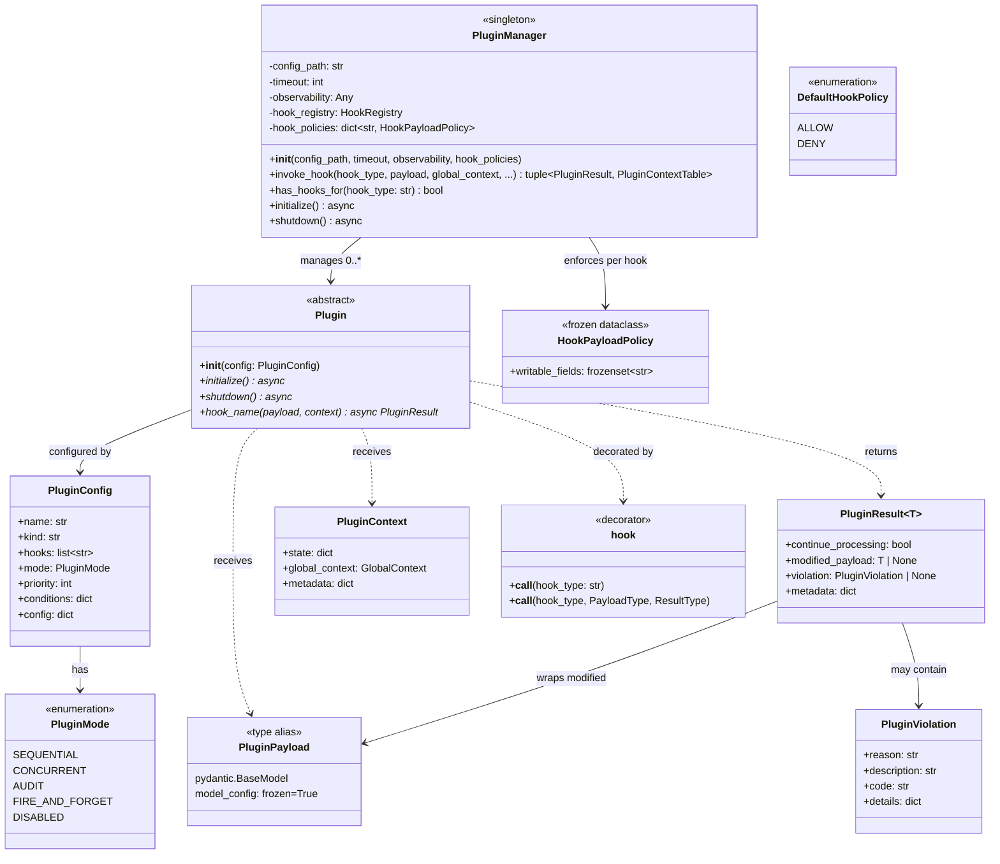

# Mellea Hook System Implementation Plan

This document describes the implementation plan for the extensibility hook system specified in [`docs/dev/hook_system.md`](hook_system.md). The implementation uses [CPEX](https://github.com/contextforge-org/contextforge-plugins-framework) as an optional external dependency for core plumbing, while all Mellea-specific types — hook enums, payload models, and the plugin base class — are owned by Mellea under a new `mellea/plugins/` subpackage.

The primary developer-facing API is the `@hook` decorator, the `Plugin` base class, and programmatic registration (`register()`, `PluginSet`). YAML configuration is supported as a secondary mechanism for deployment-time overrides. Plugins work identically whether invoked through a session or via the functional API (`instruct(backend, context, ...)`).

## 1. Package Structure

```
mellea/plugins/
├── __init__.py            # Public API: Plugin, hook, block, PluginSet, register, plugin_scope
├── manager.py             # Singleton wrapper + session-tag filtering
├── base.py                # Plugin base class, MelleaBasePayload, MelleaPlugin (advanced)
├── types.py               # HookType enum, PluginMode enum + hook registration
├── policies.py            # HookPayloadPolicy table + DefaultHookPolicy for Mellea hooks
├── context.py             # Plugin context factory helper
├── decorators.py          # @hook decorator implementation
├── pluginset.py           # PluginSet class
├── registry.py            # register(), block(), plugin_scope() + global/session dispatch logic
└── hooks/
    ├── __init__.py         # Re-exports all payload classes
    ├── session.py          # session lifecycle payloads
    ├── component.py        # component lifecycle payloads
    ├── generation.py       # generation pipeline payloads
    ├── validation.py       # validation payloads
    ├── sampling.py         # sampling pipeline payloads
    ├── tool.py             # tool execution payloads
    ├── adapter.py          # adapter operation payloads
    ├── context_ops.py      # context operation payloads
    └── error.py            # error handling payload
```

## 2. CPEX (Key Interfaces Used)

The following types from `cpex.framework` form the plumbing layer. Mellea uses these but does **not** import any CPEX-specific hook types (prompts, tools, resources, agents, http).

| Type | Role |
|------|------|
| `Plugin` | ABC base class. `__init__(config: PluginConfig)`, `initialize()`, `shutdown()`. Hook methods discovered by convention (method name = hook type) or `@hook()` decorator. Signature: `async def hook_name(self, payload, context) -> PluginResult`. |
| `PluginManager` | Borg singleton. `__init__(config_path, timeout, observability, hook_policies)`. Key methods: `invoke_hook(hook_type, payload, global_context, ...) -> (PluginResult, PluginContextTable)`, `has_hooks_for(hook_type) -> bool`, `initialize()`, `shutdown()`. The `hook_policies` parameter accepts a `dict[str, HookPayloadPolicy]` mapping hook types to their writable-field policies. |
| `PluginPayload` | Base type for all hook payloads. Frozen Pydantic `BaseModel` (`ConfigDict(frozen=True)`). Plugins use `model_copy(update={...})` to propose modifications. |
| `PluginResult[T]` | Generic result: `continue_processing: bool`, `modified_payload: T | None`, `violation: PluginViolation | None`, `metadata: dict`. |
| `PluginViolation` | `reason`, `description`, `code`, `details`. |
| `PluginConfig` | `name`, `kind`, `hooks`, `mode`, `priority`, `conditions`, `config`, ... |
| `PluginMode` | `SEQUENTIAL`, `CONCURRENT`, `AUDIT`, `FIRE_AND_FORGET`, `DISABLED`. |
| `PluginContext` | `state: dict`, `global_context: GlobalContext`, `metadata: dict`. |
| `HookPayloadPolicy` | Frozen dataclass with `writable_fields: frozenset[str]`. Defines which payload fields plugins may modify for a given hook type. |
| `DefaultHookPolicy` | Enum: `ALLOW` (accept all modifications), `DENY` (reject all modifications). Controls behavior for hooks without an explicit policy. |
| `apply_policy()` | `apply_policy(original, modified, policy) -> BaseModel \| None`. Accepts only changes to writable fields via `model_copy(update=...)`, discarding unauthorized changes. Returns `None` if no effective changes. |
| `HookRegistry` | `get_hook_registry()`, `register_hook(hook_type, payload_class, result_class)`, `is_registered(hook_type)`. |
| `@hook` decorator | `@hook("hook_type")` or `@hook("hook_type", PayloadType, ResultType)` for custom method names. |

### Class Diagram



### YAML Plugin Configuration (reference)

Plugins can also be configured via YAML as a secondary mechanism. Programmatic registration via `@hook`, `Plugin` subclasses, and `register()` is the primary approach.

```yaml
plugins:
  - name: content-policy
    kind: mellea.plugins.examples.ContentPolicyPlugin
    hooks:
      - component_pre_create
      - generation_post_call
    mode: sequential
    priority: 10
    config:
      blocked_terms: ["term1", "term2"]

  - name: telemetry
    kind: mellea.plugins.examples.TelemetryPlugin
    hooks:
      - component_post_success
      - sampling_loop_end
    mode: fire_and_forget
    priority: 100
    config:
      endpoint: "https://telemetry.example.com"
```

### Mellea Wrapper Layer

Mellea exposes its own `@hook` decorator and `Plugin` base class that translate to CPEX registrations internally. This serves two purposes:

1. **Mellea-aligned API**: The `@hook` decorator accepts a `mode` parameter using Mellea's own `PluginMode` enum (`PluginMode.SEQUENTIAL`, `PluginMode.CONCURRENT`, `PluginMode.AUDIT`, `PluginMode.FIRE_AND_FORGET`), which maps to CPEX's internal `PluginMode` enum. The `Plugin` base class uses `__init_subclass__` keyword arguments (`name=`, `priority=`) for ergonomic metadata declaration.
2. **Session tagging**: Mellea's wrapper adds session-scoping metadata that CPEX's `PluginManager` does not natively support. The `manager.py` layer filters hooks at dispatch time based on session tags.

Users never import from `cpex.framework` directly.

## 3. Core Types

### 3.1 `HookType` enum (`mellea/plugins/types.py`)

A single `HookType(str, Enum)` containing all hook types. String-based values for compatibility with CPEX's `invoke_hook(hook_type: str, ...)`.

```python
class HookType(str, Enum):
    # Session Lifecycle
    SESSION_PRE_INIT = "session_pre_init"
    SESSION_POST_INIT = "session_post_init"
    SESSION_RESET = "session_reset"
    SESSION_CLEANUP = "session_cleanup"

    # Component Lifecycle
    COMPONENT_PRE_CREATE = "component_pre_create"
    COMPONENT_POST_CREATE = "component_post_create"
    COMPONENT_PRE_EXECUTE = "component_pre_execute"
    COMPONENT_POST_SUCCESS = "component_post_success"
    COMPONENT_POST_ERROR = "component_post_error"

    # Generation Pipeline
    GENERATION_PRE_CALL = "generation_pre_call"
    GENERATION_POST_CALL = "generation_post_call"
    GENERATION_STREAM_CHUNK = "generation_stream_chunk"

    # Validation
    VALIDATION_PRE_CHECK = "validation_pre_check"
    VALIDATION_POST_CHECK = "validation_post_check"

    # Sampling Pipeline
    SAMPLING_LOOP_START = "sampling_loop_start"
    SAMPLING_ITERATION = "sampling_iteration"
    SAMPLING_REPAIR = "sampling_repair"
    SAMPLING_LOOP_END = "sampling_loop_end"

    # Tool Execution
    TOOL_PRE_INVOKE = "tool_pre_invoke"
    TOOL_POST_INVOKE = "tool_post_invoke"

    # Backend Adapter Ops
    ADAPTER_PRE_LOAD = "adapter_pre_load"
    ADAPTER_POST_LOAD = "adapter_post_load"
    ADAPTER_PRE_UNLOAD = "adapter_pre_unload"
    ADAPTER_POST_UNLOAD = "adapter_post_unload"

    # Context Operations
    CONTEXT_UPDATE = "context_update"
    CONTEXT_PRUNE = "context_prune"

    # Error Handling
    ERROR_OCCURRED = "error_occurred"
```

### 3.2 `MelleaBasePayload` (`mellea/plugins/base.py`)

All Mellea hook payloads inherit from this base, which extends `PluginPayload` with the common fields from the hook system spec (Section 2):

```python
class MelleaBasePayload(PluginPayload):
    """Frozen base — all payloads are immutable by design.

    Plugins must use ``model_copy(update={...})`` to propose modifications
    and return the copy via ``PluginResult.modified_payload``.  The plugin
    manager applies the hook's ``HookPayloadPolicy`` to filter changes to
    writable fields only.
    """
    model_config = ConfigDict(frozen=True, arbitrary_types_allowed=True)

    session_id: str | None = None
    request_id: str
    timestamp: datetime = Field(default_factory=datetime.utcnow)
    hook: str
    user_metadata: dict[str, Any] = Field(default_factory=dict)
```

`frozen=True` prevents in-place mutations — attribute assignment on a payload instance raises `FrozenModelError`. `arbitrary_types_allowed=True` is required because payloads include non-serializable Mellea objects (`Backend`, `Context`, `Component`, `ModelOutputThunk`). This means external plugins cannot receive these payloads directly; they are designed for native in-process plugins.

### 3.3 Hook Registration (`mellea/plugins/types.py`)

A `register_mellea_hooks()` function registers all hook types with CPEX `HookRegistry`. Called once during plugin initialization. Idempotent via `is_registered()` check.

```python
def register_mellea_hooks() -> None:
    registry = get_hook_registry()
    for hook_type, (payload_cls, result_cls) in _HOOK_REGISTRY.items():
        if not registry.is_registered(hook_type):
            registry.register_hook(hook_type, payload_cls, result_cls)
```

### 3.4 Context Mapping (`mellea/plugins/context.py`)

CPEX provides a generic `GlobalContext` with a `state: dict`. The `build_global_context` factory populates it with lightweight, cross-cutting ambient metadata. Hook-specific data (context, session, action, etc.) belongs on the typed payload, not here.

```python
def build_global_context(
    *,
    backend: Backend | None = None,
    **extra_fields,
) -> GlobalContext:
    state: dict[str, Any] = {}
    if backend is not None:
        state["backend_name"] = getattr(backend, "model_id", "unknown")
    state.update(extra_fields)
    return GlobalContext(request_id="", state=state)
```

> **Design note**: Previously, `context`, `session`, and the full `backend` object were stored in `GlobalContext.state`, duplicating data already present on typed payloads. This was removed to eliminate the duplication footgun — plugins should access domain objects through the typed, policy-controlled payload fields.

### 3.5 `Plugin` Base Class (`mellea/plugins/base.py`)

`Plugin` is the primary base class for multi-hook Mellea plugins. It is one of two ways to define plugins, alongside `@hook` on standalone functions (simplest). `Plugin` provides automatic context-manager support and plugin metadata via `__init_subclass__` keyword arguments.

```python
class Plugin:
    """Base class for multi-hook Mellea plugins.

    Subclasses get automatic context-manager support and plugin metadata::

        class PIIRedactor(Plugin, name="pii-redactor", priority=5):
            @hook(HookType.COMPONENT_PRE_CREATE, mode=PluginMode.SEQUENTIAL)
            async def redact_input(self, payload, ctx):
                ...

        with PIIRedactor():
            result = session.instruct("...")
    """

    def __init_subclass__(
        cls, *, name: str = "", priority: int = 50, **kwargs: Any
    ) -> None:
        """Set plugin metadata on subclasses that provide a ``name``."""
        super().__init_subclass__(**kwargs)
        if name:
            cls._mellea_plugin_meta = PluginMeta(name=name, priority=priority)

    def __enter__(self) -> Any: ...
    def __exit__(self, exc_type, exc_val, exc_tb) -> None: ...
    async def __aenter__(self) -> Any: ...
    async def __aexit__(self, exc_type, exc_val, exc_tb) -> None: ...
```

`Plugin` has no cpex dependency and does not require lifecycle hooks. All context-manager methods delegate to `_plugin_cm_enter`/`_plugin_cm_exit` module-level helpers that handle UUID scope generation and registration/deregistration.

### 3.5b `MelleaPlugin` Advanced Base Class (`mellea/plugins/base.py`)

`MelleaPlugin` extends CPEX's `Plugin` with typed context accessor helpers. Use this **only** when you need cpex lifecycle hooks (`initialize`/`shutdown`) or typed context accessors. For all other cases, prefer the lighter-weight `Plugin` base class.

```python
class MelleaPlugin(_CpexPlugin):
    """Advanced base class for Mellea plugins with lifecycle hooks and typed accessors."""

    def get_backend_name(self, context: PluginContext) -> str | None:
        return context.global_context.state.get("backend_name")

    @property
    def plugin_config(self) -> dict[str, Any]:
        return self._config.config or {}
```

`MelleaPlugin` is **not** part of the primary public API and is not exported from `mellea.plugins`. Users who need it import it directly from `mellea.plugins.base`. CPEX's `initialize()` and `shutdown()` suffice — no new abstract methods are added.

### 3.6 `@hook` Decorator (`mellea/plugins/decorators.py`)

The `@hook` decorator works on both standalone async functions and `Plugin` subclass methods:

```python
@dataclass(frozen=True)
class HookMeta:
    hook_type: str
    mode: PluginMode = PluginMode.SEQUENTIAL
    priority: int = 50

def hook(
    hook_type: str,
    *,
    mode: PluginMode = PluginMode.SEQUENTIAL,
    priority: int = 50,
) -> Callable:
    """Register an async function or method as a hook handler."""
    def decorator(fn):
        import inspect
        if not inspect.iscoroutinefunction(fn):
            raise TypeError(
                f"@hook-decorated function {fn.__qualname__!r} must be async "
                f"(defined with 'async def'), got a regular function."
            )
        fn._mellea_hook_meta = HookMeta(
            hook_type=hook_type,
            mode=mode,
            priority=priority,
        )
        return fn
    return decorator
```

The `mode` parameter uses Mellea's `PluginMode` enum, which maps to CPEX's internal `PluginMode`:
- `PluginMode.SEQUENTIAL`: Hook is awaited inline, executed serially. Violations halt the chain.
- `PluginMode.CONCURRENT`: Hook is awaited inline, but run concurrently with other `concurrent` hooks. Violations are honored.
- `PluginMode.AUDIT`: Hook is awaited inline. Violations are logged but execution continues.
- `PluginMode.FIRE_AND_FORGET`: Hook is dispatched as a background `asyncio.create_task()`. Result is ignored. This is handled by CPEX's `PluginManager` dispatch logic.

When used on a standalone function, the metadata is read at `register()` time or when passed to `start_session(plugins=[...])`. When used on a `Plugin` subclass method, it is discovered during class registration via `_ClassPluginAdapter` introspection.

### 3.7 `PluginMeta` (`mellea/plugins/base.py`)

Plugin metadata is attached to `Plugin` subclasses automatically via `__init_subclass__`:

```python
@dataclass(frozen=True)
class PluginMeta:
    name: str
    priority: int = 50
```

When a class inherits from `Plugin` with `name=` and/or `priority=` keyword arguments, `__init_subclass__` stores a `PluginMeta` instance as `cls._mellea_plugin_meta`. On registration, all methods with `_mellea_hook_meta` are discovered and registered as hook handlers bound to the instance. Methods without `@hook` are ignored.

### 3.8 `PluginSet` (`mellea/plugins/pluginset.py`)

A named, composable group of hook functions and plugin instances:

```python
class PluginSet:
    def __init__(
        self,
        name: str,
        items: list[Callable | Any | "PluginSet"],
        *,
        priority: int | None = None,
    ):
        self.name = name
        self.items = items
        self.priority = priority

    def flatten(self) -> list[tuple[Callable | Any, int | None]]:
        """Recursively flatten nested PluginSets into (item, priority_override) pairs."""
        result = []
        for item in self.items:
            if isinstance(item, PluginSet):
                result.extend(item.flatten())
            else:
                result.append((item, self.priority))
        return result
```

PluginSets are inert containers — they do not register anything themselves. Registration happens when they are passed to `register()` or `start_session(plugins=[...])`.

### 3.9 `block()` Helper (`mellea/plugins/registry.py`)

Convenience function for returning a blocking result from a hook:

```python
def block(
    reason: str,
    *,
    code: str = "",
    description: str = "",
    details: dict[str, Any] | None = None,
) -> PluginResult:
    return PluginResult(
        continue_processing=False,
        violation=PluginViolation(
            reason=reason,
            description=description or reason,
            code=code,
            details=details or {},
        ),
    )
```


### 3.10 Hook Payload Policies (`mellea/plugins/policies.py`)

Defines the concrete per-hook-type policies for Mellea hooks. These are injected into the `PluginManager` at initialization time via the `hook_policies` parameter.

```python
from cpex.framework.hooks.policies import HookPayloadPolicy

MELLEA_HOOK_PAYLOAD_POLICIES: dict[str, HookPayloadPolicy] = {
    # Session Lifecycle
    "session_pre_init": HookPayloadPolicy(
        writable_fields=frozenset({"model_id", "model_options"}),
    ),
    # session_post_init, session_reset, session_cleanup: observe-only (no entry)

    # Component Lifecycle
    "component_pre_create": HookPayloadPolicy(
        writable_fields=frozenset({
            "description", "images", "requirements", "icl_examples",
            "grounding_context", "user_variables", "prefix", "template_id",
        }),
    ),
    "component_post_create": HookPayloadPolicy(
        writable_fields=frozenset({"component"}),
    ),
    "component_pre_execute": HookPayloadPolicy(
        writable_fields=frozenset({
            "requirements", "model_options", "format",
            "strategy", "tool_calls_enabled",
        }),
    ),
    # component_post_success, component_post_error: observe-only

    # Generation Pipeline
    "generation_pre_call": HookPayloadPolicy(
        writable_fields=frozenset({"model_options", "format", "tool_calls"}),
    ),
    # generation_post_call: observe-only
    "generation_stream_chunk": HookPayloadPolicy(
        writable_fields=frozenset({"chunk", "accumulated"}),
    ),

    # Validation
    "validation_pre_check": HookPayloadPolicy(
        writable_fields=frozenset({"requirements", "model_options"}),
    ),
    "validation_post_check": HookPayloadPolicy(
        writable_fields=frozenset({"results", "all_validations_passed"}),
    ),

    # Sampling Pipeline
    "sampling_loop_start": HookPayloadPolicy(
        writable_fields=frozenset({"loop_budget"}),
    ),
    # sampling_iteration, sampling_repair, sampling_loop_end: observe-only

    # Tool Execution
    "tool_pre_invoke": HookPayloadPolicy(
        writable_fields=frozenset({"model_tool_call"}),
    ),
    "tool_post_invoke": HookPayloadPolicy(
        writable_fields=frozenset({"tool_output"}),
    ),

    # adapter_*, context_*, error_occurred: observe-only (no entry)
}
```

Hooks absent from this table are observe-only. With `DefaultHookPolicy.DENY` (the Mellea default), any modification attempt on an observe-only hook is rejected with a warning log.

## 4. Plugin Manager Integration (`mellea/plugins/manager.py`)

### 4.1 Lazy Singleton Wrapper

The `PluginManager` is lazily initialized on first use (either via `register()` or `start_session(plugins=[...])`). A config path is no longer required — code-first registration may be the only path.

```python
_plugin_manager: PluginManager | None = None
_plugins_enabled: bool = False
_session_tags: dict[str, set[str]] = {}  # session_id -> set of plugin keys

def has_plugins() -> bool:
    """Fast check: are plugins configured and available?"""
    return _plugins_enabled

def get_plugin_manager() -> PluginManager | None:
    """Returns the initialized PluginManager, or None if plugins are not configured."""
    return _plugin_manager

def ensure_plugin_manager() -> PluginManager:
    """Lazily initialize the PluginManager if not already created."""
    global _plugin_manager, _plugins_enabled
    if _plugin_manager is None:
        register_mellea_hooks()
        pm = PluginManager(
            "",
            timeout=5,
            hook_policies=MELLEA_HOOK_PAYLOAD_POLICIES,
        )
        _run_async_in_thread(pm.initialize())
        _plugin_manager = pm
        _plugins_enabled = True
    return _plugin_manager

async def initialize_plugins(
    config_path: str | None = None, *, timeout: float = 5.0
) -> PluginManager:
    """Initialize the PluginManager with Mellea hook registrations and optional YAML config."""
    global _plugin_manager, _plugins_enabled
    register_mellea_hooks()
    pm = PluginManager(
        config_path or "",
        timeout=int(timeout),
        hook_policies=MELLEA_HOOK_PAYLOAD_POLICIES,
    )
    await pm.initialize()
    _plugin_manager = pm
    _plugins_enabled = True
    return pm

async def shutdown_plugins() -> None:
    """Shut down the PluginManager."""
    global _plugin_manager, _plugins_enabled, _session_tags
    if _plugin_manager is not None:
        await _plugin_manager.shutdown()
    _plugin_manager = None
    _plugins_enabled = False
    _session_tags.clear()
```

### 4.2 `invoke_hook()` Central Helper

All hook call sites use this single function. Three layers of no-op guards ensure zero overhead when plugins are not configured:

1. **`_plugins_enabled` boolean** — module-level, a single pointer dereference
2. **`has_hooks_for(hook_type)`** — skips invocation when no plugin subscribes to this hook
3. **Returns `(None, original_payload)` immediately** when either guard fails

The wrapper accepts only `backend` and optional `**context_fields` as kwargs. Domain-specific data (context, session, action, etc.) belongs on the typed payload, not on the invocation kwargs.

```python
async def invoke_hook(
    hook_type: HookType,
    payload: MelleaBasePayload,
    *,
    backend: Backend | None = None,
    **context_fields,
) -> tuple[PluginResult | None, MelleaBasePayload]:
    """Invoke a hook if plugins are configured.

    Returns (result, possibly-modified-payload).
    If plugins are not configured, returns (None, original_payload) immediately.
    """
    if not _plugins_enabled or _plugin_manager is None:
        return None, payload

    if not _plugin_manager.has_hooks_for(hook_type.value):
        return None, payload

    # Payloads are frozen — use model_copy to set dispatch-time fields
    updates: dict[str, Any] = {"hook": hook_type.value}
    payload = payload.model_copy(update=updates)

    global_ctx = build_global_context(backend=backend, **context_fields)

    result, _ = await _plugin_manager.invoke_hook(
        hook_type=hook_type.value,
        payload=payload,
        global_context=global_ctx,
        violations_as_exceptions=False,
    )

    modified = result.modified_payload if result and result.modified_payload else payload
    return result, modified
```

### 4.3 Session-Scoped Registration

`start_session()` in `mellea/stdlib/session.py` gains an optional `plugins` keyword parameter:

```python
def start_session(
    ...,
    plugins: list[Callable | Any | PluginSet] | None = None,
) -> MelleaSession:
```

When `plugins` is provided, `start_session()` registers each item with the session's ID via `register(items, session_id=session.id)`. These plugins fire only within this session, in addition to any globally registered plugins. They are automatically deregistered when the session is cleaned up (at `session_cleanup`).

### 4.4 With-Block-Scoped Registration (Context Managers)

Both plugin forms — standalone `@hook` functions and `Plugin` subclass instances — plus `PluginSet` support the Python context manager protocol for block-scoped activation. This is a fourth registration scope complementing global, session-scoped, and YAML-configured plugins.

#### Mechanism

With-block scopes reuse the existing `session_id` tagging infrastructure from section 4.3. Each `with` entry generates a fresh UUID scope ID, registers plugins with that scope ID, and deregisters them by scope ID on exit. The `_session_tags` dict in `manager.py` tracks these scope IDs alongside session IDs — the manager makes no distinction between them at dispatch time.

#### `plugin_scope()` factory (`mellea/plugins/registry.py`)

A `_PluginScope` internal class and `plugin_scope()` public factory serve as the universal entry point, accepting any mix of standalone functions, `Plugin` instances, and `PluginSet`s:

```python
class _PluginScope:
    """Context manager that activates a set of plugins for a block of code."""

    def __init__(self, items: list[Callable | Any | PluginSet]) -> None:
        self._items = items
        self._scope_id: str | None = None

    def _activate(self) -> None:
        self._scope_id = str(uuid.uuid4())
        register(self._items, session_id=self._scope_id)

    def _deactivate(self) -> None:
        if self._scope_id is not None:
            deregister_session_plugins(self._scope_id)
            self._scope_id = None

    def __enter__(self) -> _PluginScope:
        self._activate()
        return self

    def __exit__(self, exc_type, exc_val, exc_tb) -> None:
        self._deactivate()

    async def __aenter__(self) -> _PluginScope:
        self._activate()
        return self

    async def __aexit__(self, exc_type, exc_val, exc_tb) -> None:
        self._deactivate()


def plugin_scope(*items: Callable | Any | PluginSet) -> _PluginScope:
    """Create a context manager that activates the given plugins for a block of code."""
    return _PluginScope(list(items))
```

#### `Plugin` subclass instances (`mellea/plugins/base.py`)

The `Plugin` base class provides `__enter__`, `__exit__`, `__aenter__`, `__aexit__` directly. The context-manager methods delegate to module-level helpers:

```python
def _plugin_cm_enter(self: Any) -> Any:
    if getattr(self, "_scope_id", None) is not None:
        meta = getattr(type(self), "_mellea_plugin_meta", None)
        plugin_name = meta.name if meta else type(self).__name__
        raise RuntimeError(
            f"Plugin {plugin_name!r} is already active as a context manager. "
            "Concurrent or nested reuse of the same instance is not supported; "
            "create a new instance instead."
        )
    self._scope_id = str(uuid.uuid4())
    register(self, session_id=self._scope_id)
    return self


def _plugin_cm_exit(self: Any, exc_type: Any, exc_val: Any, exc_tb: Any) -> None:
    scope_id = getattr(self, "_scope_id", None)
    if scope_id is not None:
        deregister_session_plugins(scope_id)
        self._scope_id = None


class Plugin:
    def __init_subclass__(cls, *, name: str = "", priority: int = 50, **kwargs):
        super().__init_subclass__(**kwargs)
        if name:
            cls._mellea_plugin_meta = PluginMeta(name=name, priority=priority)

    def __enter__(self) -> Any:
        return _plugin_cm_enter(self)

    def __exit__(self, exc_type, exc_val, exc_tb) -> None:
        _plugin_cm_exit(self, exc_type, exc_val, exc_tb)

    async def __aenter__(self) -> Any:
        return self.__enter__()

    async def __aexit__(self, exc_type, exc_val, exc_tb) -> None:
        self.__exit__(exc_type, exc_val, exc_tb)
```

#### `PluginSet` (`mellea/plugins/pluginset.py`)

`PluginSet` gains the same context manager protocol using the same UUID scope ID pattern:

```python
def __enter__(self) -> PluginSet:
    if self._scope_id is not None:
        raise RuntimeError(
            f"PluginSet {self.name!r} is already active as a context manager. "
            "Create a new instance to use in a separate scope."
        )
    self._scope_id = str(uuid.uuid4())
    register(self, session_id=self._scope_id)
    return self

def __exit__(self, exc_type, exc_val, exc_tb) -> None:
    if self._scope_id is not None:
        deregister_session_plugins(self._scope_id)
        self._scope_id = None

async def __aenter__(self) -> PluginSet:
    return self.__enter__()

async def __aexit__(self, exc_type, exc_val, exc_tb) -> None:
    self.__exit__(exc_type, exc_val, exc_tb)
```

#### `MelleaPlugin` (`mellea/plugins/base.py`)

`MelleaPlugin` also supports the context manager protocol. Because `MelleaPlugin` subclasses CPEX `Plugin` (which owns `__init__`), the scope ID is stored as an instance attribute accessed via `getattr` with a default rather than declared in `__init__`:

```python
def __enter__(self) -> MelleaPlugin:
    if getattr(self, "_scope_id", None) is not None:
        raise RuntimeError(
            f"MelleaPlugin {self.name!r} is already active as a context manager. "
            "Create a new instance to use in a separate scope."
        )
    self._scope_id = str(uuid.uuid4())
    register(self, session_id=self._scope_id)
    return self

def __exit__(self, exc_type, exc_val, exc_tb) -> None:
    scope_id = getattr(self, "_scope_id", None)
    if scope_id is not None:
        deregister_session_plugins(scope_id)
        self._scope_id = None

async def __aenter__(self) -> MelleaPlugin:
    return self.__enter__()

async def __aexit__(self, exc_type, exc_val, exc_tb) -> None:
    self.__exit__(exc_type, exc_val, exc_tb)
```

#### Deregistration helper (`mellea/plugins/manager.py`)

A `deregister_session_plugins(scope_id)` function removes all plugins tagged with a given scope ID from the `PluginManager` and cleans up the `_session_tags` entry. This is the same function used by `session_cleanup` to deregister session-scoped plugins:

```python
def deregister_session_plugins(session_id: str) -> None:
    """Deregister all plugins associated with a given session or scope ID."""
    pm = _plugin_manager
    if pm is None:
        return
    plugin_keys = _session_tags.pop(session_id, set())
    for key in plugin_keys:
        pm.deregister(key)
```

#### Public API

`plugin_scope` is exported from `mellea.plugins`:

```python
from mellea.plugins import plugin_scope
```

All three forms (`plugin_scope`, `Plugin` subclass instance, `PluginSet`) support both `with` and `async with`. `MelleaPlugin` instances also support the protocol for advanced use cases. The same-instance re-entrant restriction applies to all forms: attempting to re-enter an already-active instance raises `RuntimeError`. Create separate instances to activate the same plugin logic in nested or concurrent scopes.

### 4.5 Dependency Management

Add to `pyproject.toml` under `[project.optional-dependencies]`:

```toml
plugins = ["contextforge-plugin-framework>=0.1.0"]
```

All imports in `mellea/plugins/` are guarded with `try/except ImportError`.

### 4.6 Global Registration (`mellea/plugins/registry.py`)

Global registration happens via `register()` at application startup:

```python
def register(
    items: Callable | Any | PluginSet | list[Callable | Any | PluginSet],
    *,
    session_id: str | None = None,
) -> None:
    """Register plugins globally or for a specific session.

    When session_id is None, plugins are global (fire for all invocations).
    When session_id is provided, plugins fire only within that session.

    Accepts standalone @hook functions, Plugin subclass instances,
    MelleaPlugin instances, PluginSets, or lists thereof.
    """
    pm = ensure_plugin_manager()

    if not isinstance(items, list):
        items = [items]

    for item in items:
        if isinstance(item, PluginSet):
            for flattened_item, priority_override in item.flatten():
                _register_single(pm, flattened_item, session_id, priority_override)
        else:
            _register_single(pm, item, session_id, None)


def _register_single(
    pm: PluginManager,
    item: Callable | Any,
    session_id: str | None,
    priority_override: int | None,
) -> None:
    """Register a single hook function or plugin instance.

    - Standalone functions with _mellea_hook_meta: wrapped in _FunctionHookAdapter
    - Plugin subclass instances (with _mellea_plugin_meta): methods with _mellea_hook_meta discovered and wrapped in _ClassPluginAdapter
    - MelleaPlugin instances: registered directly with CPEX
    """
    ...
```

A `_FunctionHookAdapter` internal class wraps a standalone `@hook`-decorated function into a CPEX `Plugin` for the `PluginManager`. A `_ClassPluginAdapter` wraps `Plugin` subclass instances similarly, discovering all `@hook`-decorated methods:

```python
class _FunctionHookAdapter(Plugin):
    """Adapts a standalone @hook-decorated function into a CPEX Plugin."""

    def __init__(self, fn: Callable, session_id: str | None = None):
        meta = fn._mellea_hook_meta
        config = PluginConfig(
            name=fn.__qualname__,
            kind=fn.__module__ + "." + fn.__qualname__,
            hooks=[meta.hook_type],
            mode=_map_mode(meta.mode),
            priority=meta.priority,
        )
        super().__init__(config)
        self._fn = fn
        self._session_id = session_id

    async def initialize(self):
        pass

    async def shutdown(self):
        pass
```

## 5. Hook Call Sites

**Session context threading**: All `invoke_hook` calls pass `session_id` when operating within a session. For the functional API path, `session_id` is `None` and only globally registered plugins are dispatched. Session-scoped plugins (registered via `start_session(plugins=[...])`) fire only when the dispatch context matches their session ID.

### 5.1 Session Lifecycle

**File**: `mellea/stdlib/session.py`

`start_session()` gains the `plugins` parameter for session-scoped registration:

```python
def start_session(
    backend_name: ... = "ollama",
    model_id: ... = IBM_GRANITE_4_MICRO_3B,
    ctx: Context | None = None,
    *,
    model_options: dict | None = None,
    plugins: list[Callable | Any | PluginSet] | None = None,
    **backend_kwargs,
) -> MelleaSession:
```

Session-scoped plugins passed via `plugins=[...]` are registered with this session's ID and deregistered at `session_cleanup`.

| Hook | Location | Trigger | Result Handling |
|------|----------|---------|-----------------|
| `session_pre_init` | `start_session()`, before `backend_class(model_id, ...)` (~L163) | Before backend instantiation | Supports payload modification: updated `model_options`, `model_id`. Violation blocks session creation. |
| `session_post_init` | `start_session()`, after `MelleaSession(backend, ctx)` (~L191) | Session fully created | Observability-only. |
| `session_reset` | `MelleaSession.reset()`, before `self.ctx.reset_to_new()` (~L269) | Context about to reset | Observability-only. |
| `session_cleanup` | `MelleaSession.cleanup()`, at top of method (~L272) | Before teardown | Observability-only. Must not raise. Deregisters session-scoped plugins. |

**Sync/async bridge**: These are sync methods. Use `_run_async_in_thread(invoke_hook(...))` from `mellea/helpers/__init__.py`.

**Payload examples**:

```python
# session_pre_init
SessionPreInitPayload(
    backend_name=backend_name,
    model_id=str(model_id),
    model_options=model_options,
    context_type=type(ctx).__name__ if ctx else "SimpleContext",
)

# session_post_init
SessionPostInitPayload(session=session)

# session_cleanup
SessionCleanupPayload(
    context=self.ctx,
    interaction_count=len(self.ctx.as_list()),
)
```

### 5.2 Component Lifecycle

**Files**: `mellea/stdlib/components/instruction.py` (`Instruction.__init__`), `mellea/stdlib/components/chat.py` (`Message.__init__`), `mellea/stdlib/functional.py` (`aact()`)

> **`component_pre_create` and `component_post_create` are deferred.** These hooks are not implemented in this iteration. See the discussion note at the end of this section.

| Hook | Location | Trigger | Result Handling |
|------|----------|---------|-----------------|
| `component_pre_create` | *(deferred — not implemented)* | — | — |
| `component_post_create` | *(deferred — not implemented)* | — | — |
| `component_pre_execute` | `aact()`, at top before strategy branch (~L492) | Before generation begins | Supports `model_options`, `requirements`, `strategy`, `format`, `tool_calls_enabled` modification. Violation blocks execution. |
| `component_post_success` | `aact()`, after result in both branches (~L506, ~L534) | Successful execution | Observability-only. |
| `component_post_error` | `aact()`, in new `try/except Exception` wrapping the body | Exception during execution | Observability-only. Always re-raises after hook. |

**Key changes to `aact()`**:
- Add `time.monotonic()` at entry for latency measurement
- Wrap body (lines ~492–546) in `try/except Exception`
- `except` handler: fire `component_post_error` then `error_occurred`, then re-raise
- Insert `component_post_success` before each `return` path

> **Discussion — why `component_pre_create` and `component_post_create` are deferred:**
>
> `Component` is currently a `Protocol`, not an abstract base class. Mellea has no ownership over component initialization: there are no guarantees about when or how subclass `__init__` methods run, and there is no single interception point that covers all `Component` implementations. Calling hooks manually inside `Instruction.__init__` and `Message.__init__` works for those classes, but it is fragile (any user-defined `Component` subclass is invisible) and requires per-class boilerplate.
>
> If `Component` were refactored to an abstract base class, the ABC could wrap `__init__` and fire these hooks generically for every subclass. Until that refactoring is decided, these hook types are excluded from the active hook system: they are not in `HookType`, have no payload classes, no registered call sites, and no tests. The hook names and payload designs remain documented here for when the refactoring occurs. Use `component_pre_execute` for pre-execution interception in the meantime.

**Sync/async bridge for PRE/POST_CREATE** *(relevant if/when these hooks are implemented)*: `Instruction.__init__` and `Message.__init__` are synchronous. Use `_run_async_in_thread(invoke_hook(...))` from `mellea/helpers/__init__.py`. `backend` and `context` are `None`.

**Payload examples**:

```python
# component_pre_create (Instruction case — inside Instruction.__init__, before attrs)
ComponentPreCreatePayload(
    component_type="Instruction",
    description=description,
    images=images,
    requirements=requirements,
    icl_examples=icl_examples,
    grounding_context=grounding_context,
    user_variables=user_variables,
    prefix=prefix,
)

# component_pre_execute
ComponentPreExecutePayload(
    component_type=type(action).__name__,
    action=action,
    context=context,
    requirements=requirements or [],
    model_options=model_options or {},
    format=format,
    strategy_name=type(strategy).__name__ if strategy else None,
    tool_calls_enabled=tool_calls,
)

# component_post_success
ComponentPostSuccessPayload(
    component_type=type(action).__name__,
    action=action,
    result=result,
    context_before=context,
    context_after=new_ctx,
    generate_log=result._generate_log,
    sampling_results=sampling_result if strategy else None,
    latency_ms=int((time.monotonic() - t0) * 1000),
)
```

### 5.3 Generation Pipeline

**Approach**: `Backend.__init_subclass__` in `mellea/core/backend.py` automatically wraps `generate_from_context` in every concrete backend subclass that defines it. This avoids modifying all backend implementations (Ollama, OpenAI, HuggingFace, vLLM, Watsonx, LiteLLM) individually. No separate `generate_from_context_with_hooks()` method is added.

The wrapper is injected at class definition time and applies to all current and future `Backend` subclasses transparently.

**`generation_post_call` timing**: The post-call hook fires via an `_on_computed` callback set on the returned `ModelOutputThunk`:

- **Lazy MOTs** (normal path): `_on_computed` fires inside `ModelOutputThunk.astream` after `post_process` completes, when the value is fully materialized. `latency_ms` reflects the full wall-clock time from the `generate_from_context` call to value availability. `model_output` replacement is supported — the original MOT's output fields are updated in-place via `_copy_from`.
- **Already-computed MOTs** (e.g. cached responses or test mocks): `astream` returns early without firing `_on_computed`, so the hook is fired inline before the wrapper returns. `model_output` replacement is supported on this path.

**Writable fields applied from `generation_pre_call`**: `model_options`, `format`, `tool_calls`.

| Hook | Location | Trigger | Result Handling |
|------|----------|---------|-----------------|
| `generation_pre_call` | `Backend.__init_subclass__` wrapper, before `generate_from_context` delegate | Before LLM API call | Supports `model_options`, `format`, `tool_calls` modification. Violation blocks (e.g., token budget exceeded). |
| `generation_post_call` | Via `_on_computed` callback on `ModelOutputThunk` (lazy path), or inline before return (already-computed path) | After output fully materialized | Observability-only. |
| `generation_stream_chunk` | **Deferred** — requires hooks in `ModelOutputThunk.astream()` streaming path | Per streaming chunk | Fire-and-forget to avoid slowing streaming. |

### 5.4 Validation

**File**: `mellea/stdlib/functional.py`, in `avalidate()` (~L699–753)

| Hook | Location | Trigger | Result Handling |
|------|----------|---------|-----------------|
| `validation_pre_check` | After `reqs` prepared (~L713), before validation loop | Before validation | Supports `requirements` list modification (inject/filter). |
| `validation_post_check` | After all validations, before `return rvs` (~L753) | After validation | Supports `results` override. Primarily observability. |

**Payload examples**:

```python
# validation_pre_check
ValidationPreCheckPayload(
    requirements=reqs,
    target=output,
    context=context,
    model_options=model_options or {},
)

# validation_post_check
ValidationPostCheckPayload(
    requirements=reqs,
    results=rvs,
    all_validations_passed=all(bool(r) for r in rvs),
    passed_count=sum(1 for r in rvs if bool(r)),
    failed_count=sum(1 for r in rvs if not bool(r)),
)
```

### 5.5 Sampling Pipeline

**File**: `mellea/stdlib/sampling/base.py`, in `BaseSamplingStrategy.sample()` (~L94–256)

| Hook | Location | Trigger | Result Handling |
|------|----------|---------|-----------------|
| `sampling_loop_start` | Before `for` loop (~L157) | Loop begins | Supports `loop_budget` modification. |
| `sampling_iteration` | Inside loop, after validation (~L192) | Each iteration | Observability. Violation can force early termination. |
| `sampling_repair` | After `self.repair()` call (~L224) | Repair invoked | Observability-only. |
| `sampling_loop_end` | Before return in success (~L209) and failure (~L249) paths | Loop ends | Observability-only. |

**Additional change**: Add `_get_repair_type() -> str` method to each sampling strategy subclass:

| Strategy Class | Repair Type |
|---|---|
| `RejectionSamplingStrategy` | `"identity"` |
| `RepairTemplateStrategy` | `"template_repair"` |
| `MultiTurnStrategy` | `"multi_turn_message"` |
| `SOFAISamplingStrategy` | `"sofai_feedback"` |

**Payload examples**:

```python
# sampling_loop_start
SamplingLoopStartPayload(
    strategy_name=type(self).__name__,
    action=action,
    context=context,
    requirements=reqs,
    loop_budget=self.loop_budget,
)

# sampling_repair
SamplingRepairPayload(
    repair_type=self._get_repair_type(),
    failed_action=sampled_actions[-1],
    failed_result=sampled_results[-1],
    failed_validations=sampled_scores[-1],
    repair_action=next_action,
    repair_context=next_context,
    repair_iteration=loop_count,
)
```

### 5.6 Tool Execution

**File**: `mellea/stdlib/functional.py`, in the `_call_tools()` helper (~L904)

| Hook | Location | Trigger | Result Handling |
|------|----------|---------|-----------------|
| `tool_pre_invoke` | Before `tool.call_func()` (~L917) | Before tool call | Supports `model_tool_call` replacement. Violation blocks tool call. |
| `tool_post_invoke` | After `tool.call_func()` (~L919) | After tool call | Supports `tool_output` modification. Primarily observability. |

### 5.7 Backend Adapter Operations

**Files**: `mellea/backends/openai.py` (`load_adapter` ~L907, `unload_adapter` ~L944), `mellea/backends/huggingface.py` (`load_adapter` ~L1192, `unload_adapter` ~L1224)

| Hook | Location | Trigger | Result Handling |
|------|----------|---------|-----------------|
| `adapter_pre_load` | Start of `load_adapter()` | Before adapter load | Violation prevents loading. |
| `adapter_post_load` | End of `load_adapter()` | After adapter loaded | Observability. |
| `adapter_pre_unload` | Start of `unload_adapter()` | Before adapter unload | Violation prevents unloading. |
| `adapter_post_unload` | End of `unload_adapter()` | After adapter unloaded | Observability. |

**Sync/async bridge**: Adapter methods are synchronous. Use `_run_async_in_thread(invoke_hook(...))`.

### 5.8 Context Operations

**Files**: `mellea/stdlib/context.py` (`ChatContext.add()` ~L17, `SimpleContext.add()` ~L31)

| Hook | Location | Trigger | Result Handling |
|------|----------|---------|-----------------|
| `context_update` | After `from_previous()` in `add()` | Context appended | Observability-only (context is immutable). |
| `context_prune` | `ChatContext.view_for_generation()` when window truncates | Context windowed | Observability-only. |

**Performance note**: `context_update` fires on every context addition, which is frequent. The `has_hooks_for()` guard is critical — when no plugin subscribes to `context_update`, the overhead is a single boolean check.

### 5.9 Error Handling

**File**: `mellea/stdlib/functional.py` (utility function callable from any error path)

| Hook | Location | Trigger | Result Handling |
|------|----------|---------|-----------------|
| `error_occurred` | `aact()` except block + utility `fire_error_hook()` | Unrecoverable error | Observability-only. Must never raise from own execution. |

**Fires for**: `ComponentParseError`, backend communication errors, assertion violations, unhandled exceptions during component execution, validation, or tool invocation.

**Does NOT fire for**: Validation failures within sampling loops (handled by `sampling_iteration`/`sampling_repair`), controlled `PluginViolation` blocks (those are policy decisions, not errors).

**Utility function**:

```python
async def fire_error_hook(
    error: Exception,
    location: str,
    *,
    session=None, backend=None, context=None, action=None,
) -> None:
    """Fire the error_occurred hook. Never raises."""
    try:
        payload = ErrorOccurredPayload(
            error=error,
            error_type=type(error).__name__,
            error_location=location,
            stack_trace=traceback.format_exc(),
            recoverable=False,
            action=action,
        )
        await invoke_hook(
            HookType.ERROR_OCCURRED, payload,
            session=session, backend=backend, context=context,
            violations_as_exceptions=False,
        )
    except Exception:
        pass  # Never propagate errors from error hook
```


## 8. Modifications Summary

| File | Changes |
|------|---------|
| `mellea/stdlib/components/instruction.py` | `COMPONENT_PRE_CREATE` (before attr assignment) and `COMPONENT_POST_CREATE` (after attr assignment) hooks in `Instruction.__init__` |
| `mellea/stdlib/components/chat.py` | Same PRE/POST_CREATE hooks in `Message.__init__` |
| `mellea/stdlib/functional.py` | Component execute/success/error hooks in `aact()`; validation and tool hooks |
| `mellea/stdlib/session.py` | 4 session hooks + `plugins` param on `start_session()` + session-scoped plugin registration/deregistration |
| `mellea/stdlib/sampling/base.py` | 4 sampling hooks |
| `mellea/core/backend.py` | `Backend.__init_subclass__` wraps `generate_from_context` in all subclasses, injecting `GENERATION_PRE_CALL` and `GENERATION_POST_CALL` hooks; post-call hook fires via `_on_computed` callback on the returned `ModelOutputThunk` |
| `mellea/stdlib/context.py` | 2 context operation hooks in `ChatContext.add()`, `SimpleContext.add()` |
| `mellea/backends/openai.py` | 4 adapter hooks in `load_adapter()` / `unload_adapter()` |
| `mellea/backends/huggingface.py` | 4 adapter hooks in `load_adapter()` / `unload_adapter()` |
| `pyproject.toml` | Add `plugins` optional dependency + `plugins` test marker |
| `mellea/plugins/__init__.py` (new) | Public API: `Plugin`, `hook`, `block`, `PluginSet`, `register`, `plugin_scope`, `PluginMode`, `HookType`, `PluginResult`, `PluginViolationError` |
| `mellea/plugins/decorators.py` (new) | `@hook` decorator implementation, `HookMeta` |
| `mellea/plugins/pluginset.py` (new) | `PluginSet` class with `flatten()` for recursive expansion; context manager protocol for with-block scoping |
| `mellea/plugins/registry.py` (new) | `register()`, `block()`, `_FunctionHookAdapter`, `_ClassPluginAdapter`, `_register_single()`; `_PluginScope` class and `plugin_scope()` factory for with-block scoping |
| `mellea/plugins/manager.py` (new) | Singleton wrapper, `invoke_hook()` with session-tag filtering, `ensure_plugin_manager()`; `deregister_session_plugins()` for scope cleanup (used by both session and with-block exit) |
| `mellea/plugins/base.py` (new) | `Plugin` base class (lightweight, no cpex dep) with `__init_subclass__` and context manager protocol; `PluginMeta`; `MelleaBasePayload` (frozen); `MelleaPlugin` (advanced cpex-based class); `PluginViolationError` |
| `mellea/plugins/types.py` (new) | `HookType` enum, `PluginMode` enum, `register_mellea_hooks()` |
| `mellea/plugins/policies.py` (new) | `MELLEA_HOOK_PAYLOAD_POLICIES` table, injected into `PluginManager` at init |
| `mellea/plugins/context.py` (new) | `build_global_context()` factory |
| `mellea/plugins/hooks/` (new) | Hook payload dataclasses (session, component, generation, etc.) |
| `test/plugins/` (new) | Tests for plugins subpackage |

> Note: + update docs and add examples.
